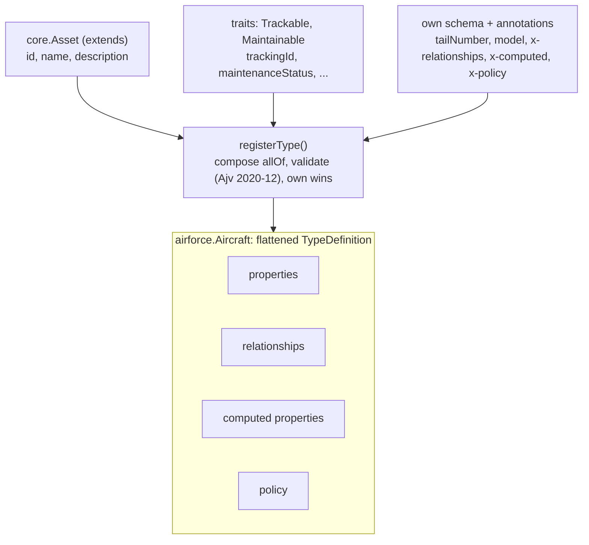
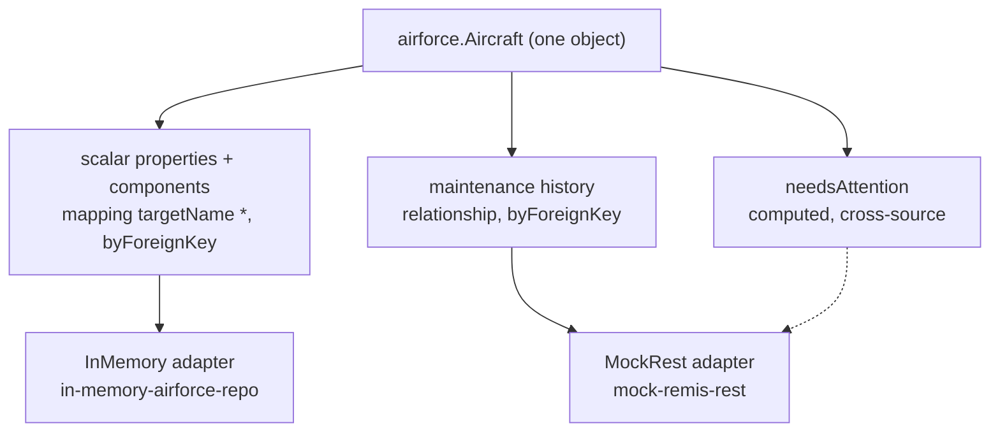

# TypeSys

TypeSys (or _TypeS_, as it's affectionately known) is a **governed semantic
runtime**: a canonical layer between physical enterprise systems (databases,
REST APIs, legacy platforms) and their consumers (applications and AI
agents), so a consumer can ask for an object, its relationships, its
provenance, and the actions it can perform, without knowing which system
produced the answer, and with policy, classification, and audit enforced
on the way through. The name undersells it: the Types are the vocabulary,
and the product is the one governed boundary every read and every Action
passes. It is an open, standards-based take on the same problem Palantir
Ontology addresses — built on JSON Schema 2020-12, a pluggable policy
engine (embedded ABAC or Cedar), and the Model Context Protocol — not a
clone of it.

> **Status: production-shaped, not production-proven.** The architecture
> is implemented and tested end to end against real PostgreSQL, Redis, and
> a KMS emulator, and it is suitable for pilots and carefully scoped
> workloads. It has not had an external security review, real-KMS
> validation, HA or production-scale load testing, or an accreditation
> boundary. [`docs/PRODUCTION-READINESS.md`](docs/PRODUCTION-READINESS.md)
> ranks what remains, and [`docs/completeness.md`](docs/completeness.md)
> says what is and isn't built.

> **New here?** → [`docs/README.md`](docs/README.md) is the full
> documentation index (tutorial, how-tos, reference, ADRs). Evaluating
> whether this is the right tool? → [`docs/why-typesys.md`](docs/why-typesys.md).
> Starting your own project on TypeS? →
> [`docs/how-to/start-a-project.md`](docs/how-to/start-a-project.md).
> Building an AI agent against the MCP server? →
> [`docs/for-agents.md`](docs/for-agents.md), or read
> [`llms.txt`](llms.txt) at the repo root for the token-efficient map.

## Why TypeS?

Your applications and your AI agents both need to ask "give me this
Aircraft, its components, where that data came from, and what I'm
allowed to do to it" — without either of them needing to know the
answer actually lives across a Postgres database, a legacy REST API,
and a message queue.

### The mental model

| Concept | Is | You supply it as |
|---|---|---|
| **Type** | what something means | JSON Schema 2020-12 (or YAML), composed from base types and traits |
| **Mapping** | where its data comes from | `DataSource` and `Mapping` records, one per part of an object |
| **Adapter** | how to talk to that source | an in-memory, REST, or Postgres adapter, or one you write |
| **Policy** | who may do what | ABAC rules or a Cedar policy set, plus a classification scheme |
| **Action** | what can be done to it | a governed capability with input schema, preconditions, side effects |
| **Runtime** | the governed execution boundary | `SemanticRuntime`, which TypeS provides; you only configure it |

Everything else (authorization plans, provenance, security profiles,
registry stores) refines one of these six.

### Key capabilities

| Capability | What it does | Why it matters |
|---|---|---|
| **A versioned high-assurance profile** | `securityProfile: HIGH_ASSURANCE_V1` is a named set of guarantees — exact row security, aggregation only through structurally derived plans, no raw subject or object identifiers in traces, managed keys, no demonstration components, well-formed configuration, enumerated engine faults — checked at start-up, with every downgrade refused ([ADR-0046](docs/adr/0046-security-profiles.md), [ADR-0047](docs/adr/0047-no-raw-identifiers-in-telemetry.md), [`run-high-assurance.md`](docs/how-to/run-high-assurance.md)). | An assessor signs off on a version, and a misconfigured deployment fails to start instead of running weaker. |
| **One governed boundary** | Every read, query, and Action goes through `SemanticRuntime`, the only place policy, classification, audit, and provenance happen ([ADR-0009](docs/adr/0009-embedded-abac-policy-engine.md), [ADR-0032](docs/adr/0032-data-classification-enforcement.md)). | Human apps and AI agents get identical enforcement, because there is only one path to enforce. |
| **Canonical types on open standards** | Types are JSON Schema 2020-12, composed from base types and traits, versioned and aliased ([`add-a-type.md`](docs/how-to/add-a-type.md)). | One object model across every backend, with no proprietary schema language to learn. |
| **Multi-source objects** | One object's properties, relationships, and computed values can each come from a different system ([`combine-multiple-sources.md`](docs/how-to/combine-multiple-sources.md)). | Consumers see one Aircraft, not a Postgres row plus a REST payload to reconcile themselves. |
| **Relationships beyond foreign keys** | Foreign-key, own-field, many-to-many (`byJoinTable`), and composite-key relationships from one shared parser, with bounded, ordered traversal ([ADR-0028](docs/adr/0028-relationship-resolution-strategies.md)). | Model real associations (a provider's patients, an aircraft's crew) without a graph database or a synthetic join Type. |
| **Pluggable adapters** | In-memory, REST, and PostgreSQL adapters ship; a new backend is one small interface ([`write-an-adapter.md`](docs/how-to/write-an-adapter.md)). | Swap or add systems of record without touching consumers. |
| **Object-, row-, and property-level ABAC** | Named policy rules gate Types, individual properties, and Actions, and deny by default; a rule can decide on the object's own attributes, so "this clinician, this patient" is expressible and a query returns only the rows you may read, or is refused when you may read none of the Type ([ADR-0049](docs/adr/0049-a-query-the-caller-can-read-none-of-is-refused.md)); an id nothing holds is a `NotFoundError`, raised only after the rule has decided ([ADR-0048](docs/adr/0048-a-missing-object-is-not-found.md)). Rules built from the helpers are pushed into the adapter's filter as an authorization plan, so pages come back full and a clinician can count their own patients ([ADR-0030](docs/adr/0030-row-level-authorization.md), [ADR-0038](docs/adr/0038-authorization-planning.md), [`add-a-policy-rule.md`](docs/how-to/add-a-policy-rule.md)). | Sensitive fields and records are hidden per caller, decided on the data itself rather than on who is asking alone. |
| **A real, swappable policy engine** | `CedarPolicyEngine` runs Cedar in-process (WebAssembly) behind the same `PolicyEngine` interface: policies validated against a schema before the process serves a request, fail-closed on any evaluation error, proven to decide identically to the embedded engine on both demo domains, and planned through Cedar's partial evaluation so its rules are pushed into queries too ([ADR-0031](docs/adr/0031-cedar-policy-engine.md), [ADR-0039](docs/adr/0039-cedar-partial-evaluation-planner.md), [`policy-cedar`](packages/policy-cedar/README.md)). | Authorization rules become an analyzable, reviewable policy set, with no change to Types, adapters, or the runtime. |
| **Per-property provenance** | Every value can report which source produced it, when, and at what confidence ([ADR-0008](docs/adr/0008-provenance-model.md)). | Values a decision rests on come with their origin, which regulated environments require. |
| **Field-level encryption at rest** | An `EncryptingAdapter` wraps any adapter so named fields are ciphertext in every store behind it, each bound to its record so it can't be moved between records, equality lookups survive through blind indexes, anything that would need plaintext in the store is refused, decrypted or marked data never reaches a cache that isn't confidential — `EncryptedCache` makes Redis one — and keys can be data keys wrapped by a KMS key, leased so revocation takes effect ([ADR-0033](docs/adr/0033-field-level-encryption.md), [ADR-0035](docs/adr/0035-record-bound-encryption-envelope.md), [ADR-0036](docs/adr/0036-sensitive-data-caching.md), [ADR-0037](docs/adr/0037-kms-backed-key-provider.md), [`encrypt-fields.md`](docs/how-to/encrypt-fields.md)). | A database dump, backup, or replica doesn't hold the PHI; the runtime still does all its work on plaintext. |
| **Data classification** | Types, properties, and individual values carry markings; the scheme you configure decides whole labels for whole subjects — levels, compartments, releasability, and CUI as its own regime in the reference scheme — and until you configure one, marked data is denied; enforced beside the policy engine, with derived values carrying the join of their inputs' labels ([ADR-0032](docs/adr/0032-data-classification-enforcement.md), [ADR-0034](docs/adr/0034-classification-scheme-defaults.md), [ADR-0041](docs/adr/0041-security-labels-v2.md), [`classify-data.md`](docs/how-to/classify-data.md)). | Classified and controlled data is redacted per reader by a mandatory control that no policy, and no engine swap, can relax. |
| **Append-only audit log** | Every policy and classification decision — allow and deny, including the authorization preview `listActions` reports — and every audited Action is recorded, with which control decided and which runtime operation it was decided under; the Postgres store enforces append-only with a trigger ([ADR-0042](docs/adr/0042-audit-rows-name-the-operation.md)). | A tamper-resistant record of who read or changed what, and of every refusal. |
| **Governed Actions** | Writes run a policy check and the clearance their Types require, input validation against the Action's schema, and preconditions before the side effect ([ADR-0005](docs/adr/0005-actions-as-first-class-governed-capabilities.md)). | Business rules are enforced once, centrally, not per caller. |
| **AI agents over MCP** | Types, objects, relationships, and provenance are MCP resources; Actions, `query`, and `aggregate` are tools; identity is resolved on every call over stdio or HTTP. The server takes any registry and runtime and a resolver you supply, and names no domain ([ADR-0050](docs/adr/0050-the-mcp-server-serves-any-registry.md), [`for-agents.md`](docs/for-agents.md)). | Agents discover and act on the same semantic contract applications use, under the same enforcement, with no hand-written tool per backend. |
| **Structured, bounded queries** | A JSON query DSL — filters, `sort`, projection (`select`), relationship `include`s, grouped aggregation, and full-text `search` — schema-validated with size limits, every extension fail-closed under property policy ([ADR-0027](docs/adr/0027-query-dsl-extensions.md)). | Callers get expressive reads (order, shape, roll-ups, text search), and one caller still can't request unbounded work. |
| **Operational controls** | Opt-in caching, per-identity rate limiting, one concurrency budget per request, per-adapter-call timeouts / retries / circuit-breaking, and OpenTelemetry tracing and metrics ([`enable-caching.md`](docs/how-to/enable-caching.md), [ADR-0026](docs/adr/0026-adapter-call-resilience.md), [`enable-observability.md`](docs/how-to/enable-observability.md)). | Tune cost, latency, and resilience per deployment, and see what the runtime is doing. |
| **Runs as several replicas** | Shared Redis cache and rate limiter, concurrency-safe migrations, a load test, and ready-to-run deployment artifacts — a `Dockerfile`, `docker-compose`, reference Kubernetes manifests, and `/healthz`/`/readyz` probes ([`run-multiple-instances.md`](docs/how-to/run-multiple-instances.md), [`deploy-with-containers.md`](docs/how-to/deploy-with-containers.md)). | Scale out behind a load balancer with one cache and one budget per identity — and an image to actually ship. |
| **Real identity and persistence** | OIDC/JWT identity resolution ([ADR-0018](docs/adr/0018-oidc-identity-resolution.md)) and a durable PostgreSQL registry ([`use-postgres.md`](docs/how-to/use-postgres.md)). | Drop-in pieces for moving beyond the demo tokens and in-memory store. |
| **Domains as packages** | A domain is a package you add, never code edited into core; the hospital domain ships with zero core changes ([`adding-a-domain.md`](docs/developer-guide/adding-a-domain.md)). | New domains for years without a growing shared core. |
| **YAML authoring and codegen** | Define Types in YAML and generate TypeScript interfaces from the registry ([`generate-typescript-types.md`](docs/how-to/generate-typescript-types.md)). | Non-TypeScript authors can contribute, and consumers get type safety. |

**Use it when:**

- You have (or will have) more than one physical system that need to
  present a single, coherent object model to consumers — see
  [`docs/how-to/combine-multiple-sources.md`](docs/how-to/combine-multiple-sources.md)
  for the three real, tested ways to do that.
- Authorization has to be enforced identically everywhere a piece of
  data is read — not re-implemented per UI, per API endpoint, per agent
  tool. One policy boundary (`SemanticRuntime`), so a human application
  and an AI agent get *provably identical* enforcement.
- You need to know where a value came from, not just what it is —
  regulated industries, DoD/federal environments, anywhere "trust me"
  isn't good enough for a number a decision gets made on.
- You want an AI agent to discover and act on your domain safely,
  without hand-writing a tool schema per backend or re-deriving
  authorization logic inside the agent layer.
- You're going to add domains for years and don't want every new one to
  require touching a shared core — a domain is a package you add, never
  code you edit into a core.

**Don't use it when** you have one database and one application talking
to it directly (an ORM is simpler, faster to write, and has no
canonical-layer overhead to justify), you need a mature 1.0 product
today (this is a reference implementation of a real architecture, not a
release history), or sub-millisecond zero-indirection latency is the
whole point (policy checks, audit writes, and provenance tracking are
real work done on every call).

See [`docs/why-typesys.md`](docs/why-typesys.md) for the full case —
including how this compares to a hand-rolled BFF, GraphQL/Apollo
Federation, Palantir Ontology, and just giving an
agent direct database access.

## How it works

Three views of the same system, from the outside in. The first is the
shape of the whole thing: who calls it, and the one boundary that sits
between every consumer and the data. The next two open up the two ideas
that make that shape work, how a Type is assembled from smaller parts,
and how a single object's parts resolve to different physical stores. The
request-time and policy sequences these imply are traced call by call in
[`docs/architecture.md`](docs/architecture.md).

### One governed boundary

Applications and AI agents never touch your systems directly. They go
through one runtime, and that runtime is the only place policy is
decided, classification enforced, audit written, and provenance
assembled. A human application calls it directly; an AI agent reaches it
through the MCP server. Either path inherits identical enforcement,
because there is only one path to enforce. Which engine decides policy is
a choice — the embedded ABAC rules or Cedar — and classification sits
beside it, so no engine can relax it. A read policy is also turned into an
*authorization plan* the store applies before it reads, so objects the
caller can't read are never fetched — while every object that is fetched is
still decided on its own data. Beneath the runtime, an `EncryptingAdapter`
can wrap any adapter so sensitive fields are ciphertext in the store while
the runtime works on plaintext; a versioned security profile can fix the
strongest of these settings and refuse to start without them.

```mermaid
flowchart TB
    app["Human application"]
    agent["AI agent"]
    mcp["MCP server"]
    rt["SemanticRuntime<br/>getObject · query · aggregate · invokeAction"]
    gov["Policy (ABAC or Cedar) · Classification<br/>Audit · Provenance — enforced once, per call"]
    plan["Authorization plan<br/>pushed into the adapter's filter"]
    inmem["InMemory adapter"]
    rest["MockRest adapter"]
    enc["EncryptingAdapter<br/>optional decorator"]
    pg["Postgres adapter<br/>filters compiled to SQL"]
    repo[("In-memory repo")]
    ext[("Legacy REST API")]
    pgdb[("PostgreSQL<br/>sensitive fields as ciphertext")]
    app --> rt
    agent --> mcp --> rt
    rt --- gov
    gov -.-> plan -.-> pg
    rt --> inmem --> repo
    rt --> rest --> ext
    rt --> enc --> pg --> pgdb
```



### How a Type is composed

A Type is not authored as one flat definition. It is assembled at
registration time from a single base type it `extends`, zero or more
shared `traits`, and its own schema and annotations. `registerType()`
composes those into one JSON Schema `allOf`, validates it, and merges
their members into a single flattened `TypeDefinition`, with a Type's own
definitions winning over a trait's and traits over the base.
`airforce.Aircraft` is the example carried through the repo.



### How one object maps to many stores

Nothing about the backends is baked into the Type. A separate set of
`DataSource` and `Mapping` records binds each part of an object to a
physical system, and the `Adapter` for that system does the I/O. Because
the binding is per part, one `Aircraft` read fans out across more than
one store: its scalar properties and `components` resolve from the
in-memory repository, its maintenance history from a legacy REST system,
and its `needsAttention` computed property reaches across into that REST
system even though it has no direct mapping to it.



## Packages

- **`packages/core`** (`@typesys/core`) — the meta-model, registry,
  runtime, policy engine, audit log, domain-neutral base types/traits
  (Party, Person, Organization, Location, Asset, Event), a TTL-based cache
  for `resolutionMode: "cached"` (ADR-0016), OpenTelemetry tracing/
  metrics that cost nothing unless an application registers a real SDK
  (ADR-0017), bounded-concurrency fan-out + an opt-in per-identity
  rate limiter (ADR-0019), and input validation at the runtime boundary
  (query shape + size limits, Action input against its `inputSchema`).
- **`packages/adapter-in-memory`** (`@typesys/adapter-in-memory`) — an
  in-memory repository adapter standing in for a database-backed store.
- **`packages/adapter-mock-rest`** (`@typesys/adapter-mock-rest`) — a
  mocked external REST system (its own snake_case shape and simulated
  network latency) plus the adapter that translates it into the canonical
  model.
- **`packages/domain-airforce`** (`@typesys/domain-airforce`) — the vertical
  slice domain: Aircraft/Component/MaintenanceEvent/WorkOrder, proving
  adapter substitution (Aircraft/Component on the in-memory adapter,
  MaintenanceEvent/WorkOrder on the mock-REST adapter) behind one
  consumer-facing model.
- **`packages/domain-hospital`** (`@typesys/domain-hospital`) — a second,
  unrelated domain (Patient/Provider/Appointment) proving the registry/
  runtime/MCP layers are genuinely domain-neutral (ADR-0013), with zero
  changes to `packages/core` or `packages/mcp-server`. See
  [`docs/developer-guide/adding-a-domain.md`](docs/developer-guide/adding-a-domain.md).
- **`packages/mcp-server`** (`@typesys/mcp-server`) — an MCP server exposing
  the semantic model as resources (browsing) and Actions as tools (governed
  invocation), with identity resolved fresh from a bearer token on every
  call. It serves any registry and runtime you give it, with an identity
  resolver you supply ([ADR-0050](docs/adr/0050-the-mcp-server-serves-any-registry.md)),
  over stdio (`createServer`) or a stateless Streamable HTTP transport
  (`createHttpApp`, identity from a real `Authorization` header — see
  [ADR-0021](docs/adr/0021-http-transport.md)). Over HTTP it verifies a
  bearer token it is handed; it does not run MCP's OAuth discovery flow
  itself, so it is meant to sit behind a gateway or reverse proxy that
  authenticates the caller and terminates TLS.
- **`packages/demo-web`** (`@typesys/demo-web`) — an interactive web demo
  running both domains on one registry: browse and navigate objects with
  per-property provenance, see row-level access, classification, and
  encryption at rest side by side, switch the policy engine between ABAC and
  Cedar, run queries, click through live guardrail scenarios (policy,
  validation, limits, rate limiting, the concurrency budget), drive the real
  MCP server, and watch the audit log react as you switch identity or engine.
  See [Demo](#demo) below.
- **`packages/cli`** (`@typesys/cli`) — declarative YAML authoring for
  Types (compiles to the same `SemanticTypeSchema`/`RegisterTypeOptions`
  code-authored Types use) plus a `generate-types` codegen command that
  turns registered Types into real TypeScript interfaces. See
  [`packages/cli/README.md`](packages/cli/README.md).
- **`packages/registry-store-postgres`** (`@typesys/registry-store-postgres`) —
  a production PostgreSQL-backed `RegistryStore` (migrations, keyset-paginated
  audit queries, an append-only audit table enforced by a DB trigger, and a
  `BindingRegistry` seam for the computed-property/precondition functions a
  database can never store). See [`packages/registry-store-postgres/README.md`](packages/registry-store-postgres/README.md)
  and [ADR-0015](docs/adr/0015-postgres-registry-store.md). Optional — never a
  dependency of `@typesys/core` — and its own tests are skipped unless
  `DATABASE_URL` (or `PGHOST`) is set.
- **`packages/adapter-postgres`** (`@typesys/adapter-postgres`) — a real
  `Adapter` implementation backed by PostgreSQL (a generic JSONB `objects`
  table, with query filters — authorization plans included — compiled to
  parameterized SQL and re-checked, and a pushed-down indexed query for
  `byForeignKey` relationship resolution), proving adapter substitution against a genuine database, not
  just in-memory/mocked ones. See [`packages/adapter-postgres/README.md`](packages/adapter-postgres/README.md).
  Optional, same env-gating as `registry-store-postgres`.
- **`packages/redis`** (`@typesys/redis`) — Redis-backed `Cache` and
  `RateLimiter` for running several runtime instances against shared
  state: one cache and one rate-limit budget per identity across every
  replica ([ADR-0025](docs/adr/0025-multi-instance-deployment.md)). See
  [`packages/redis/README.md`](packages/redis/README.md). Optional, and its
  tests are skipped unless `REDIS_URL` is set.
- **`packages/encryption`** (`@typesys/encryption`) — field-level encryption
  at rest: an `EncryptingAdapter` that wraps any adapter so configured
  fields are AES-256-GCM ciphertext in the store (with HMAC blind indexes
  where equality lookups must still work), behind a `KeyProvider` seam with
  keyring rotation ([ADR-0033](docs/adr/0033-field-level-encryption.md)),
  plus `EncryptedCache` and `WrappedKeyProvider` for KMS-wrapped keys.
  See [`packages/encryption/README.md`](packages/encryption/README.md).
  Optional — never a dependency of `@typesys/core`.
- **`packages/kms-aws`** (`@typesys/kms-aws`) — an AWS KMS key that wraps
  and unwraps `WrappedKeyProvider`'s data keys
  ([ADR-0037](docs/adr/0037-kms-backed-key-provider.md)), with no AWS SDK
  dependency of its own. See [`packages/kms-aws/README.md`](packages/kms-aws/README.md).
  Its emulator test is skipped unless `KMS_ENDPOINT` is set.
- **`packages/policy-cedar`** (`@typesys/policy-cedar`) — a
  [Cedar](https://www.cedarpolicy.com/)-backed `PolicyEngine`, running the
  Cedar authorizer in-process as WebAssembly: policies validated against a
  Cedar schema at load, fail-closed on any evaluation error, and proven to
  decide identically to the embedded ABAC engine on both demo domains
  ([ADR-0031](docs/adr/0031-cedar-policy-engine.md)). See
  [`packages/policy-cedar/README.md`](packages/policy-cedar/README.md).
  Optional — never a dependency of `@typesys/core`.
- **`packages/auth-oidc`** (`@typesys/auth-oidc`) — a real OIDC/JWT
  `IdentityResolver`: signature, issuer (RFC 9207), audience, and expiry
  verified via `jose` against a JWKS endpoint, scope claims mapped per
  RFC 9396. It is the `IdentityResolver` a real deployment passes to
  `createServer` or `createHttpApp` in place of the demo's token map. See
  [`packages/auth-oidc/README.md`](packages/auth-oidc/README.md) and
  [ADR-0018](docs/adr/0018-oidc-identity-resolution.md).

## Getting started

```bash
npm install
npm run build      # tsc -b across the workspace
npm test           # vitest run — Postgres-backed tests auto-skip without DATABASE_URL
npm run lint:install  # once: installs the isolated ESLint toolchain in tools/eslint
npm run lint          # type-aware ESLint across the repo (npm run lint:fix to auto-fix)
npm run typecheck     # type-checks source, tests, and scripts (the build covers only src)
npm run smoke:mcp  # spawns a real stdio MCP subprocess and runs the
                   # 7-step discover -> inspect -> retrieve -> navigate ->
                   # provenance -> list-actions -> invoke script end-to-end
npm run smoke:mcp-http  # the same script over a real HTTP transport,
                        # identity from an Authorization header (ADR-0021)
npm run benchmark  # p50/p95/p99 latency + throughput of SemanticRuntime
                   # operations (add DATABASE_URL to include the
                   # Postgres-backed adapter) — see scripts/benchmark.ts
npm run load-test  # N server processes under concurrent MCP load; add REDIS_URL
                   # to share a cache and rate limiter (docs/how-to/run-multiple-instances.md)
npm run demo       # http://localhost:4000 — see Demo below
```

## Demo

```bash
npm run demo
```

opens an interactive web app at **http://localhost:4000** wired directly to
real `SemanticRuntime`s hosting **both domains** (airforce and hospital) on
one registry, with no mocked backend. An in-process
`@modelcontextprotocol/sdk` `Server`/`Client` pair shares those runtimes,
so the MCP Console exercises the real MCP server too. There is no build step:
it's a plain static `index.html`/`app.js`/`styles.css` served by a small
Express API (`packages/demo-web/src/server.ts`).

Two switches in the header re-decide everything on screen:

- **Identity:** **Maintainer** (cleared SECRET) and **Viewer** (cleared
  CUI) for the Air Force; **Clinician A**, **Clinician B**, **Patient**, and
  **Admin** for the Hospital; or **Anonymous**. Each clinician reads only
  the patients assigned to them, decided per record (ADR-0030); only the
  Maintainer's clearance reaches the SECRET `deploymentLocation` (ADR-0032).
- **Engine:** **ABAC** (the embedded rule functions) or **Cedar** (the same
  rules as a Cedar policy set, in-process — ADR-0031). The same registry and
  adapters sit behind both, and the whole app, MCP Console included, routes
  through whichever is selected.

The hospital's Patient PHI is stored encrypted (ADR-0033): an
`EncryptingAdapter` sits in front of its store, so the store holds
ciphertext while every screen shows plaintext to whoever may see it. A
stats bar under the header shows what each request actually did: which
engine decided, how many adapter calls it made, to which systems, and how
many ran at once against the per-request concurrency budget. A health dot
reflects the server's `/healthz` and `/readyz` probes (ADR-0029).

Five tabs:

- **Explorer:** browse the Types of both domains (click one for its schema,
  relationships, actions, computed properties, policies, classification
  markings, and encrypted fields). Open an object to see each property tagged
  with the system it came from and 🔐 where it is encrypted at rest; click a
  tag for its provenance, or **trace** a computed property such as
  `needsAttention` back to the values it was derived from. Redacted
  properties say what hid them — a policy (`maintenanceStatus` for Viewer) or
  a classification (`deploymentLocation` for Viewer). Actions check policy
  and clearance, then input, then preconditions.
- **Security:** the four controls side by side, live. *Who can read which
  patient* is every identity against every Patient, with each refusal's
  reason from the selected engine. *What each clearance sees* is a clearance
  ladder and an identity-by-field view of an Aircraft, telling
  classification apart from policy. *Encrypted at rest* shows each Patient's
  stored ciphertext and blind index beside what the runtime hands you — one
  record still under a retired key, to show rotation — with an equality
  lookup through the blind index, a refused sort, and a sandboxed tamper
  the GCM tag rejects. *Two engines, one decision* runs every read path as
  every identity on both engines and compares them, beside the Cedar policy
  set itself. *A versioned high-assurance profile* asks `HIGH_ASSURANCE_V1`
  to start the demo's own configuration and shows its refusal, violation by
  violation — the demo runs on a demonstration classification scheme and
  local keys on purpose (ADR-0046).
- **Query:** the structured query DSL, with its enforced limits shown and
  examples for filters, paging (**Next page** follows `nextCursor`), nested
  includes, include filters, `sort`, projection (`select`), full-text
  `search`, grouped **aggregation** (rendered as a table of groups), a
  many-to-many `byJoinTable` traversal (ADR-0027/0028), per-record results
  and equality on an encrypted field — plus queries the runtime rejects by
  design. Results render as a navigable object tree, an aggregation table,
  or raw JSON.
- **Guardrails:** twenty-three one-click scenarios that each send a real
  request and check the outcome against the design, including filtering on a
  hidden or computed property, over-limit and malformed queries, bad action
  input (from an allowed and a disallowed identity), a failed precondition,
  cross-domain access, redaction, row-level access (another clinician's
  patient, directly, in a query, and through an appointment; and counting
  only the patients you may read, through an exact authorization plan —
  refused under Cedar, whose plans aren't exact here),
  classification (a SECRET field the CUI-cleared Viewer never sees, even by
  filtering on it), encryption (equality through the blind index; a refused
  sort), and both engines' verdicts on the same request. **Run all** checks
  them together — under either engine. The config panel lists the live
  query limits, concurrency budget, and per-call resilience policy (timeout
  / retries / breaker — ADR-0026); two live panels fire a rate-limit burst at
  a dedicated identity and visualize the concurrency budget for a nested
  query.
- **MCP Console:** the same operations through the real MCP
  `Server`/`Client`, including nested-include and invalid queries (which come
  back as `isError`), plus a custom tool-call editor. Tool results are shown
  raw and with their JSON text parsed.

The **Audit Log** drawer at the bottom is live across every tab, filterable
by decision, subject, and control: every policy decision, every
classification decision (with its joined label), every row plan a query or
aggregate applied, and every Action execution appends a row, whichever
surface triggered it. Each row names the runtime operation that wrote it,
and a ⚠ badge marks policy faults — a rule branch that failed to evaluate,
even when the decision was an allow.

## Documentation

- [`docs/architecture.md`](docs/architecture.md) — the layered architecture,
  with Mermaid diagrams for the component layout, the read pipeline, the
  policy/identity matrix, the governed write path, a cross-adapter query,
  and a governed Action invocation.
- [`docs/semantic-meta-model.md`](docs/semantic-meta-model.md) — the
  canonical meta-model specification: Type, Property, Relationship, Action,
  ComputedProperty, Policy, DataSource, Mapping, and audit/Event.
- [`docs/adr/`](docs/adr/) — architecture decision records for the major,
  hard-to-reverse choices (schema representation, type identity,
  composition, adapters, policy, versioning, query DSL, MCP mapping, domain
  packaging, persistence, the production Postgres registry store, caching,
  observability, OIDC identity resolution, concurrency/rate-limit bounds,
  publish infrastructure, the HTTP transport, multi-source composition,
  multi-instance deployment, resilience, query extensions, relationship
  strategies, deployment artifacts, row-level authorization, the Cedar
  engine, data classification, field-level encryption, classification
  defaults, record-bound envelopes, sensitive-data caching, KMS-backed keys,
  authorization planning, Cedar planning, adapter filter capabilities and
  SQL pushdown, security labels, audited operations, policy faults,
  provable numeric pushdown, telemetry identity, security profiles, no
  raw identifiers in telemetry, missing objects, unreadable queries, and a
  domain-neutral MCP server).
  [`docs/README.md`](docs/README.md) indexes all of them.
- [`docs/developer-guide/adding-a-domain.md`](docs/developer-guide/adding-a-domain.md) —
  a walkthrough adding a brand-new domain (Hospital) without modifying
  `packages/core`.

## Releasing

Versioning is coordinated with [changesets](https://github.com/changesets/changesets):
`npx changeset` records a change, `npx changeset status` shows the
version bumps it (and everything depending on it) would produce.
`.github/workflows/release.yml` runs on every push to `main` but its
publish step is gated behind an `NPM_TOKEN` repository secret that is
**not** configured here — no `@typesys/*` package has actually been
published to npm. See [ADR-0020](docs/adr/0020-publish-infrastructure.md)
for why that's a deliberate line this repo stops short of on its own.
