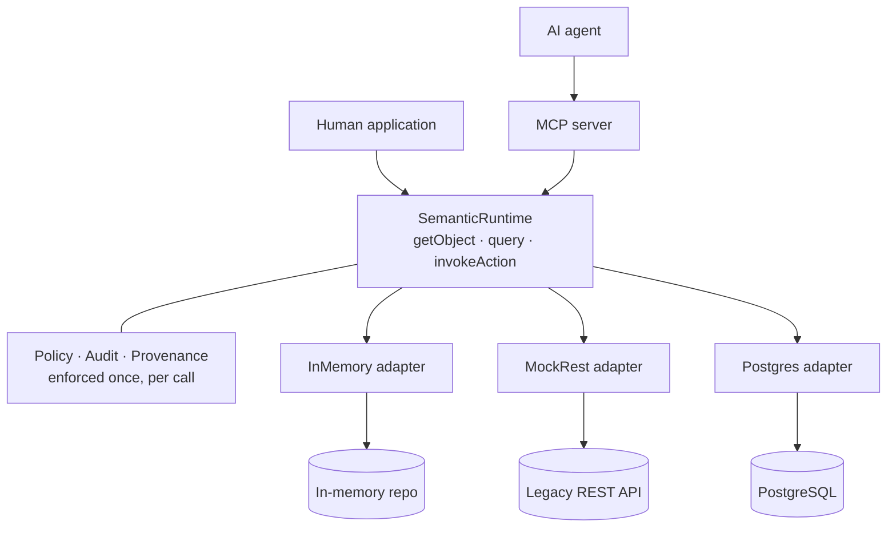
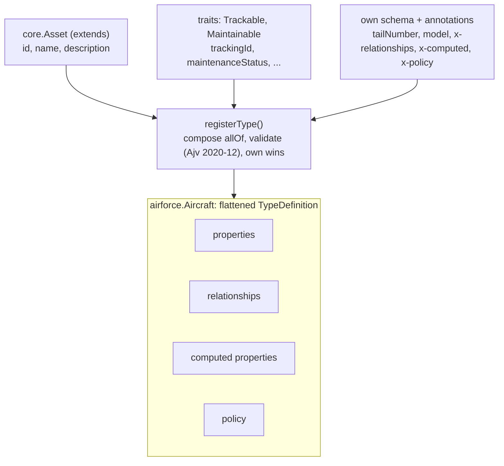
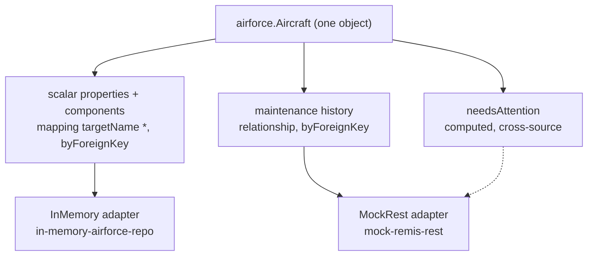

# TypeS

TypeS is a domain-neutral enterprise semantic type system: a canonical
layer between physical enterprise systems (databases, REST APIs, legacy
platforms) and their consumers (applications and AI agents), so a consumer
can ask for an object, its relationships, its provenance, and the actions
it can perform, without knowing which system produced the answer. It is an
open, standards-based take on the same problem the C3 AI Type System and
Palantir Ontology address — built on JSON Schema 2020-12, a small embedded
ABAC policy engine, and the Model Context Protocol — not a clone of either.

> **New here?** → [`docs/README.md`](docs/README.md) is the full
> documentation index (tutorial, how-tos, reference, ADRs). Evaluating
> whether this is the right tool? → [`docs/why-typesys.md`](docs/why-typesys.md).
> Building an AI agent against the MCP server? →
> [`docs/for-agents.md`](docs/for-agents.md), or read
> [`llms.txt`](llms.txt) at the repo root for the token-efficient map.

## Why TypeS?

Your applications and your AI agents both need to ask "give me this
Aircraft, its components, where that data came from, and what I'm
allowed to do to it" — without either of them needing to know the
answer actually lives across a Postgres database, a legacy REST API,
and a message queue.

**Use it when:**

- You have (or will have) more than one physical system that need to
  present a single, coherent object model to consumers — see
  [`docs/how-to/combine-multiple-sources.md`](docs/how-to/combine-multiple-sources.md)
  for the three real, tested ways to do that.
- Authorization has to be enforced identically everywhere a piece of
  data is read — not re-implemented per UI, per API endpoint, per agent
  tool. One policy boundary (`SemanticRuntime`), so a human application
  and an AI agent get *provably identical* enforcement.
- You need to know where a value came from, not just what it is —
  regulated industries, DoD/federal environments, anywhere "trust me"
  isn't good enough for a number a decision gets made on.
- You want an AI agent to discover and act on your domain safely,
  without hand-writing a tool schema per backend or re-deriving
  authorization logic inside the agent layer.
- You're going to add domains for years and don't want every new one to
  require touching a shared core — a domain is a package you add, never
  code you edit into a core.

**Don't use it when** you have one database and one application talking
to it directly (an ORM is simpler, faster to write, and has no
canonical-layer overhead to justify), you need a mature 1.0 product
today (this is a reference implementation of a real architecture, not a
release history), or sub-millisecond zero-indirection latency is the
whole point (policy checks, audit writes, and provenance tracking are
real work done on every call).

See [`docs/why-typesys.md`](docs/why-typesys.md) for the full case —
including how this compares to a hand-rolled BFF, GraphQL/Apollo
Federation, Palantir Ontology/C3 AI Type System, and just giving an
agent direct database access.

## How it works

Three views of the same system, from the outside in. The first is the
shape of the whole thing: who calls it, and the one boundary that sits
between every consumer and the data. The next two open up the two ideas
that make that shape work, how a Type is assembled from smaller parts,
and how a single object's parts resolve to different physical stores. The
request-time and policy sequences these imply are traced call by call in
[`docs/architecture.md`](docs/architecture.md).

### One governed boundary

Applications and AI agents never touch your systems directly. They go
through one runtime, and that runtime is the only place policy is
enforced, audit is written, and provenance is assembled. A human
application calls it directly; an AI agent reaches it through the MCP
server. Either path inherits identical enforcement, because there is only
one path to enforce.



### How a Type is composed

A Type is not authored as one flat definition. It is assembled at
registration time from a single base type it `extends`, zero or more
shared `traits`, and its own schema and annotations. `registerType()`
composes those into one JSON Schema `allOf`, validates it, and merges
their members into a single flattened `TypeDefinition`, with a Type's own
definitions winning over a trait's and traits over the base.
`airforce.Aircraft` is the example carried through the repo.



### How one object maps to many stores

Nothing about the backends is baked into the Type. A separate set of
`DataSource` and `Mapping` records binds each part of an object to a
physical system, and the `Adapter` for that system does the I/O. Because
the binding is per part, one `Aircraft` read fans out across more than
one store: its scalar properties and `components` resolve from the
in-memory repository, its maintenance history from a legacy REST system,
and its `needsAttention` computed property reaches across into that REST
system even though it has no direct mapping to it.



## Packages

- **`packages/core`** (`@typesys/core`) — the meta-model, registry,
  runtime, policy engine, audit log, domain-neutral base types/traits
  (Party, Person, Organization, Location, Asset, Event), a TTL-based cache
  for `resolutionMode: "cached"` (ADR-0016), OpenTelemetry tracing/
  metrics that cost nothing unless an application registers a real SDK
  (ADR-0017), bounded-concurrency fan-out + an opt-in per-identity
  rate limiter (ADR-0019), and input validation at the runtime boundary
  (query shape + size limits, Action input against its `inputSchema`).
- **`packages/adapter-in-memory`** (`@typesys/adapter-in-memory`) — an
  in-memory repository adapter standing in for a database-backed store.
- **`packages/adapter-mock-rest`** (`@typesys/adapter-mock-rest`) — a
  mocked external REST system (its own snake_case shape and simulated
  network latency) plus the adapter that translates it into the canonical
  model.
- **`packages/domain-airforce`** (`@typesys/domain-airforce`) — the vertical
  slice domain: Aircraft/Component/MaintenanceEvent/WorkOrder, proving
  adapter substitution (Aircraft/Component on the in-memory adapter,
  MaintenanceEvent/WorkOrder on the mock-REST adapter) behind one
  consumer-facing model.
- **`packages/domain-hospital`** (`@typesys/domain-hospital`) — a second,
  unrelated domain (Patient/Provider/Appointment) proving the registry/
  runtime/MCP layers are genuinely domain-neutral (ADR-0013), with zero
  changes to `packages/core` or `packages/mcp-server`. See
  [`docs/developer-guide/adding-a-domain.md`](docs/developer-guide/adding-a-domain.md).
- **`packages/mcp-server`** (`@typesys/mcp-server`) — an MCP server exposing
  the semantic model as resources (browsing) and Actions as tools (governed
  invocation), with identity resolved fresh from a bearer token on every
  call. Two transports: stdio (`bin.ts`) and a stateless Streamable HTTP
  transport (`bin-http.ts`, identity from a real `Authorization` header —
  see [ADR-0021](docs/adr/0021-http-transport.md)).
- **`packages/demo-web`** (`@typesys/demo-web`) — an interactive web demo:
  browse the type catalog, explore Aircraft/Component/MaintenanceEvent/
  WorkOrder objects, navigate relationships, invoke the governed Action,
  and watch the ABAC policy engine and audit log react live as you switch
  identity. See [Demo](#demo) below.
- **`packages/cli`** (`@typesys/cli`) — declarative YAML authoring for
  Types (compiles to the same `SemanticTypeSchema`/`RegisterTypeOptions`
  code-authored Types use) plus a `generate-types` codegen command that
  turns registered Types into real TypeScript interfaces. See
  [`packages/cli/README.md`](packages/cli/README.md).
- **`packages/registry-store-postgres`** (`@typesys/registry-store-postgres`) —
  a production PostgreSQL-backed `RegistryStore` (migrations, keyset-paginated
  audit queries, an append-only audit table enforced by a DB trigger, and a
  `BindingRegistry` seam for the computed-property/precondition functions a
  database can never store). See [`packages/registry-store-postgres/README.md`](packages/registry-store-postgres/README.md)
  and [ADR-0015](docs/adr/0015-postgres-registry-store.md). Optional — never a
  dependency of `@typesys/core` — and its own tests are skipped unless
  `DATABASE_URL` (or `PGHOST`) is set.
- **`packages/adapter-postgres`** (`@typesys/adapter-postgres`) — a real
  `Adapter` implementation backed by PostgreSQL (a generic JSONB `objects`
  table, with a pushed-down indexed query for `byForeignKey` relationship
  resolution), proving adapter substitution against a genuine database, not
  just in-memory/mocked ones. See [`packages/adapter-postgres/README.md`](packages/adapter-postgres/README.md).
  Optional, same env-gating as `registry-store-postgres`.
- **`packages/auth-oidc`** (`@typesys/auth-oidc`) — a real OIDC/JWT
  `IdentityResolver`: signature, issuer (RFC 9207), audience, and expiry
  verified via `jose` against a JWKS endpoint, scope claims mapped per
  RFC 9396. Drop-in replacement for `mcp-server`'s demo token map — same
  `IdentityResolver` shape, passed as a parameter. See
  [`packages/auth-oidc/README.md`](packages/auth-oidc/README.md) and
  [ADR-0018](docs/adr/0018-oidc-identity-resolution.md).

## Getting started

```bash
npm install
npm run build      # tsc -b across the workspace
npm test           # vitest run — Postgres-backed tests auto-skip without DATABASE_URL
npm run lint:install  # once: installs the isolated ESLint toolchain in tools/eslint
npm run lint          # ESLint across the repo (npm run lint:fix to auto-fix)
npm run smoke:mcp  # spawns a real stdio MCP subprocess and runs the
                   # 7-step discover -> inspect -> retrieve -> navigate ->
                   # provenance -> list-actions -> invoke script end-to-end
npm run smoke:mcp-http  # the same script over a real HTTP transport,
                        # identity from an Authorization header (ADR-0021)
npm run benchmark  # p50/p95/p99 latency + throughput of SemanticRuntime
                   # operations (add DATABASE_URL to include the
                   # Postgres-backed adapter) — see scripts/benchmark.ts
npm run demo       # http://localhost:4000 — see Demo below
```

## Demo

```bash
npm run demo
```

opens an interactive web app at **http://localhost:4000** wired directly to
the real `SemanticRegistry`/`SemanticRuntime` (no mocked backend) — and, via
an in-process `@modelcontextprotocol/sdk` `Server`/`Client` pair sharing that
same runtime instance, to the real MCP server too. There is no build step;
it's a plain static `index.html`/`app.js`/`styles.css` served by a small
Express API (`packages/demo-web/src/server.ts`).

Three tabs:

- **Explorer** — browse the registered Types (click one for its full
  definition: schema, relationships, actions, computed properties, policies).
  Open `airforce.Aircraft` → `AF86-0147`, expand its `components` and
  `maintenance` relationships, drill into a related object, and try the
  **CreateMaintenanceWorkOrder** action. Switch the identity pill
  (Maintainer / Viewer / Anonymous) top-right and reopen the object: the
  `maintenanceStatus` property visibly locks for Viewer, and the Action
  becomes "Not authorized" — the same object, filtered live by the policy
  engine, not a different view.
- **Query** — the structured query DSL (`SemanticQuery`) that also happens
  to be the MCP `query` tool's input schema, with a couple of canned examples.
- **MCP Console** — the exact same operations, run against a real MCP
  `Server`/`Client` pair instead of the REST API. Call
  `CreateMaintenanceWorkOrder` as Viewer (denied, `isError: true`) and then
  as Maintainer (succeeds) to see the AI-agent path enforce the identical
  governance as the human path above.

The **Audit Log** drawer at the bottom is live across all three tabs —
every policy decision (allow/deny) and Action execution appends a row in
real time, regardless of which surface triggered it.

## Documentation

- [`docs/architecture.md`](docs/architecture.md) — the layered architecture,
  with Mermaid diagrams for the component layout, the read pipeline, the
  policy/identity matrix, the governed write path, a cross-adapter query,
  and a governed Action invocation.
- [`docs/semantic-meta-model.md`](docs/semantic-meta-model.md) — the
  canonical meta-model specification: Type, Property, Relationship, Action,
  ComputedProperty, Policy, DataSource, Mapping, and audit/Event.
- [`docs/adr/`](docs/adr/) — architecture decision records for the major,
  hard-to-reverse choices (schema representation, type identity,
  composition, adapters, policy, versioning, query DSL, MCP mapping, domain
  packaging, persistence, the production Postgres registry store, caching,
  observability, OIDC identity resolution, concurrency/rate-limit bounds,
  publish infrastructure).
- [`docs/developer-guide/adding-a-domain.md`](docs/developer-guide/adding-a-domain.md) —
  a walkthrough adding a brand-new domain (Hospital) without modifying
  `packages/core`.

## Releasing

Versioning is coordinated with [changesets](https://github.com/changesets/changesets):
`npx changeset` records a change, `npx changeset status` shows the
version bumps it (and everything depending on it) would produce.
`.github/workflows/release.yml` runs on every push to `main` but its
publish step is gated behind an `NPM_TOKEN` repository secret that is
**not** configured here — no `@typesys/*` package has actually been
published to npm. See [ADR-0020](docs/adr/0020-publish-infrastructure.md)
for why that's a deliberate line this repo stops short of on its own.
