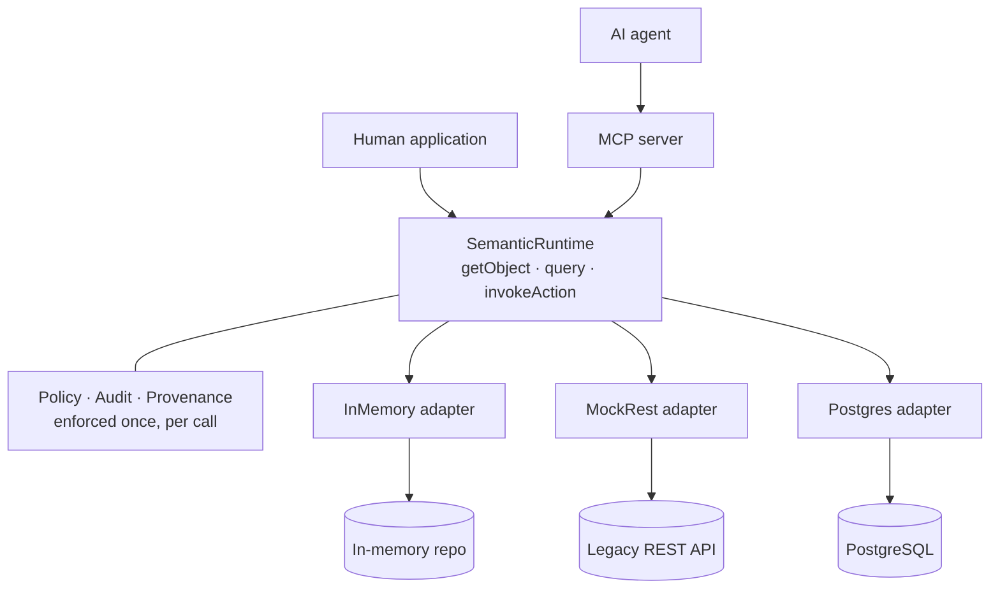
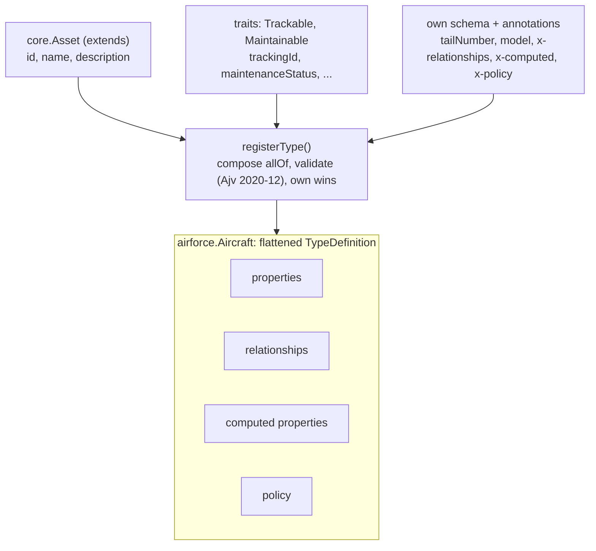
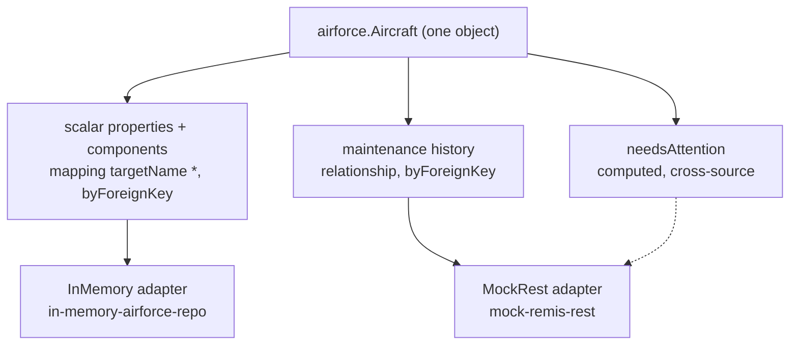

# TypeS

TypeS is a domain-neutral enterprise semantic type system: a canonical
layer between physical enterprise systems (databases, REST APIs, legacy
platforms) and their consumers (applications and AI agents), so a consumer
can ask for an object, its relationships, its provenance, and the actions
it can perform, without knowing which system produced the answer. It is an
open, standards-based take on the same problem Palantir Ontology
addresses — built on JSON Schema 2020-12, a small embedded ABAC policy
engine, and the Model Context Protocol — not a clone of it.

> **New here?** → [`docs/README.md`](docs/README.md) is the full
> documentation index (tutorial, how-tos, reference, ADRs). Evaluating
> whether this is the right tool? → [`docs/why-typesys.md`](docs/why-typesys.md).
> Building an AI agent against the MCP server? →
> [`docs/for-agents.md`](docs/for-agents.md), or read
> [`llms.txt`](llms.txt) at the repo root for the token-efficient map.

## Why TypeS?

Your applications and your AI agents both need to ask "give me this
Aircraft, its components, where that data came from, and what I'm
allowed to do to it" — without either of them needing to know the
answer actually lives across a Postgres database, a legacy REST API,
and a message queue.

### Key capabilities

| Capability | What it does | Why it matters |
|---|---|---|
| **One governed boundary** | Every read, query, and Action goes through `SemanticRuntime`, the only place policy, audit, and provenance happen ([ADR-0009](docs/adr/0009-embedded-abac-policy-engine.md)). | Human apps and AI agents get identical enforcement, because there is only one path to enforce. |
| **Canonical types on open standards** | Types are JSON Schema 2020-12, composed from base types and traits, versioned and aliased ([`add-a-type.md`](docs/how-to/add-a-type.md)). | One object model across every backend, with no proprietary schema language to learn. |
| **Multi-source objects** | One object's properties, relationships, and computed values can each come from a different system ([`combine-multiple-sources.md`](docs/how-to/combine-multiple-sources.md)). | Consumers see one Aircraft, not a Postgres row plus a REST payload to reconcile themselves. |
| **Relationships beyond foreign keys** | Foreign-key, own-field, many-to-many (`byJoinTable`), and composite-key relationships from one shared parser, with bounded, ordered traversal ([ADR-0028](docs/adr/0028-relationship-resolution-strategies.md)). | Model real associations (a provider's patients, an aircraft's crew) without a graph database or a synthetic join Type. |
| **Pluggable adapters** | In-memory, REST, and PostgreSQL adapters ship; a new backend is one small interface ([`write-an-adapter.md`](docs/how-to/write-an-adapter.md)). | Swap or add systems of record without touching consumers. |
| **Object-, row-, and property-level ABAC** | Named policy rules gate Types, individual properties, and Actions, and deny by default; a rule can decide on the object's own attributes, so "this clinician, this patient" is expressible and a query returns only the rows you may read ([ADR-0030](docs/adr/0030-row-level-authorization.md), [`add-a-policy-rule.md`](docs/how-to/add-a-policy-rule.md)). | Sensitive fields and records are hidden per caller, and the engine can be swapped for OPA or Cedar. |
| **Per-property provenance** | Every value can report which source produced it, when, and at what confidence ([ADR-0008](docs/adr/0008-provenance-model.md)). | Values a decision rests on come with their origin, which regulated environments require. |
| **Append-only audit log** | Every policy decision and audited Action is recorded; the Postgres store enforces append-only with a trigger. | A tamper-resistant record of who read or changed what. |
| **Governed Actions** | Writes run a policy check, input validation against the Action's schema, and preconditions before the side effect ([ADR-0005](docs/adr/0005-actions-as-first-class-governed-capabilities.md)). | Business rules are enforced once, centrally, not per caller. |
| **AI agents over MCP** | Types and objects become MCP resources and Actions become tools, with identity resolved on every call over stdio or HTTP ([`for-agents.md`](docs/for-agents.md)). | Agents can discover and act on a domain safely, with no hand-written tool per backend. |
| **Structured, bounded queries** | A JSON query DSL — filters, `sort`, projection (`select`), relationship `include`s, grouped aggregation, and full-text `search` — schema-validated with size limits, every extension fail-closed under property policy ([ADR-0027](docs/adr/0027-query-dsl-extensions.md)). | Callers get expressive reads (order, shape, roll-ups, text search), and one caller still can't request unbounded work. |
| **Operational controls** | Opt-in caching, per-identity rate limiting, one concurrency budget per request, per-adapter-call timeouts / retries / circuit-breaking, and OpenTelemetry tracing and metrics ([`enable-caching.md`](docs/how-to/enable-caching.md), [ADR-0026](docs/adr/0026-adapter-call-resilience.md), [`enable-observability.md`](docs/how-to/enable-observability.md)). | Tune cost, latency, and resilience per deployment, and see what the runtime is doing. |
| **Runs as several replicas** | Shared Redis cache and rate limiter, concurrency-safe migrations, a load test, and ready-to-run deployment artifacts — a `Dockerfile`, `docker-compose`, reference Kubernetes manifests, and `/healthz`/`/readyz` probes ([`run-multiple-instances.md`](docs/how-to/run-multiple-instances.md), [`deploy-with-containers.md`](docs/how-to/deploy-with-containers.md)). | Scale out behind a load balancer with one cache and one budget per identity — and an image to actually ship. |
| **Real identity and persistence** | OIDC/JWT identity resolution ([ADR-0018](docs/adr/0018-oidc-identity-resolution.md)) and a durable PostgreSQL registry ([`use-postgres.md`](docs/how-to/use-postgres.md)). | Drop-in pieces for moving beyond the demo tokens and in-memory store. |
| **Domains as packages** | A domain is a package you add, never code edited into core; the hospital domain ships with zero core changes ([`adding-a-domain.md`](docs/developer-guide/adding-a-domain.md)). | New domains for years without a growing shared core. |
| **YAML authoring and codegen** | Define Types in YAML and generate TypeScript interfaces from the registry ([`generate-typescript-types.md`](docs/how-to/generate-typescript-types.md)). | Non-TypeScript authors can contribute, and consumers get type safety. |

**Use it when:**

- You have (or will have) more than one physical system that need to
  present a single, coherent object model to consumers — see
  [`docs/how-to/combine-multiple-sources.md`](docs/how-to/combine-multiple-sources.md)
  for the three real, tested ways to do that.
- Authorization has to be enforced identically everywhere a piece of
  data is read — not re-implemented per UI, per API endpoint, per agent
  tool. One policy boundary (`SemanticRuntime`), so a human application
  and an AI agent get *provably identical* enforcement.
- You need to know where a value came from, not just what it is —
  regulated industries, DoD/federal environments, anywhere "trust me"
  isn't good enough for a number a decision gets made on.
- You want an AI agent to discover and act on your domain safely,
  without hand-writing a tool schema per backend or re-deriving
  authorization logic inside the agent layer.
- You're going to add domains for years and don't want every new one to
  require touching a shared core — a domain is a package you add, never
  code you edit into a core.

**Don't use it when** you have one database and one application talking
to it directly (an ORM is simpler, faster to write, and has no
canonical-layer overhead to justify), you need a mature 1.0 product
today (this is a reference implementation of a real architecture, not a
release history), or sub-millisecond zero-indirection latency is the
whole point (policy checks, audit writes, and provenance tracking are
real work done on every call).

See [`docs/why-typesys.md`](docs/why-typesys.md) for the full case —
including how this compares to a hand-rolled BFF, GraphQL/Apollo
Federation, Palantir Ontology, and just giving an
agent direct database access.

## How it works

Three views of the same system, from the outside in. The first is the
shape of the whole thing: who calls it, and the one boundary that sits
between every consumer and the data. The next two open up the two ideas
that make that shape work, how a Type is assembled from smaller parts,
and how a single object's parts resolve to different physical stores. The
request-time and policy sequences these imply are traced call by call in
[`docs/architecture.md`](docs/architecture.md).

### One governed boundary

Applications and AI agents never touch your systems directly. They go
through one runtime, and that runtime is the only place policy is
enforced, audit is written, and provenance is assembled. A human
application calls it directly; an AI agent reaches it through the MCP
server. Either path inherits identical enforcement, because there is only
one path to enforce.



### How a Type is composed

A Type is not authored as one flat definition. It is assembled at
registration time from a single base type it `extends`, zero or more
shared `traits`, and its own schema and annotations. `registerType()`
composes those into one JSON Schema `allOf`, validates it, and merges
their members into a single flattened `TypeDefinition`, with a Type's own
definitions winning over a trait's and traits over the base.
`airforce.Aircraft` is the example carried through the repo.



### How one object maps to many stores

Nothing about the backends is baked into the Type. A separate set of
`DataSource` and `Mapping` records binds each part of an object to a
physical system, and the `Adapter` for that system does the I/O. Because
the binding is per part, one `Aircraft` read fans out across more than
one store: its scalar properties and `components` resolve from the
in-memory repository, its maintenance history from a legacy REST system,
and its `needsAttention` computed property reaches across into that REST
system even though it has no direct mapping to it.



## Packages

- **`packages/core`** (`@typesys/core`) — the meta-model, registry,
  runtime, policy engine, audit log, domain-neutral base types/traits
  (Party, Person, Organization, Location, Asset, Event), a TTL-based cache
  for `resolutionMode: "cached"` (ADR-0016), OpenTelemetry tracing/
  metrics that cost nothing unless an application registers a real SDK
  (ADR-0017), bounded-concurrency fan-out + an opt-in per-identity
  rate limiter (ADR-0019), and input validation at the runtime boundary
  (query shape + size limits, Action input against its `inputSchema`).
- **`packages/adapter-in-memory`** (`@typesys/adapter-in-memory`) — an
  in-memory repository adapter standing in for a database-backed store.
- **`packages/adapter-mock-rest`** (`@typesys/adapter-mock-rest`) — a
  mocked external REST system (its own snake_case shape and simulated
  network latency) plus the adapter that translates it into the canonical
  model.
- **`packages/domain-airforce`** (`@typesys/domain-airforce`) — the vertical
  slice domain: Aircraft/Component/MaintenanceEvent/WorkOrder, proving
  adapter substitution (Aircraft/Component on the in-memory adapter,
  MaintenanceEvent/WorkOrder on the mock-REST adapter) behind one
  consumer-facing model.
- **`packages/domain-hospital`** (`@typesys/domain-hospital`) — a second,
  unrelated domain (Patient/Provider/Appointment) proving the registry/
  runtime/MCP layers are genuinely domain-neutral (ADR-0013), with zero
  changes to `packages/core` or `packages/mcp-server`. See
  [`docs/developer-guide/adding-a-domain.md`](docs/developer-guide/adding-a-domain.md).
- **`packages/mcp-server`** (`@typesys/mcp-server`) — an MCP server exposing
  the semantic model as resources (browsing) and Actions as tools (governed
  invocation), with identity resolved fresh from a bearer token on every
  call. Two transports: stdio (`bin.ts`) and a stateless Streamable HTTP
  transport (`bin-http.ts`, identity from a real `Authorization` header —
  see [ADR-0021](docs/adr/0021-http-transport.md)).
- **`packages/demo-web`** (`@typesys/demo-web`) — an interactive web demo
  running both domains on one runtime: browse and navigate objects with
  per-property provenance, run queries, click through live guardrail
  scenarios (policy, validation, limits, rate limiting, the concurrency
  budget), drive the real MCP server, and watch the audit log react as you
  switch identity. See [Demo](#demo) below.
- **`packages/cli`** (`@typesys/cli`) — declarative YAML authoring for
  Types (compiles to the same `SemanticTypeSchema`/`RegisterTypeOptions`
  code-authored Types use) plus a `generate-types` codegen command that
  turns registered Types into real TypeScript interfaces. See
  [`packages/cli/README.md`](packages/cli/README.md).
- **`packages/registry-store-postgres`** (`@typesys/registry-store-postgres`) —
  a production PostgreSQL-backed `RegistryStore` (migrations, keyset-paginated
  audit queries, an append-only audit table enforced by a DB trigger, and a
  `BindingRegistry` seam for the computed-property/precondition functions a
  database can never store). See [`packages/registry-store-postgres/README.md`](packages/registry-store-postgres/README.md)
  and [ADR-0015](docs/adr/0015-postgres-registry-store.md). Optional — never a
  dependency of `@typesys/core` — and its own tests are skipped unless
  `DATABASE_URL` (or `PGHOST`) is set.
- **`packages/adapter-postgres`** (`@typesys/adapter-postgres`) — a real
  `Adapter` implementation backed by PostgreSQL (a generic JSONB `objects`
  table, with a pushed-down indexed query for `byForeignKey` relationship
  resolution), proving adapter substitution against a genuine database, not
  just in-memory/mocked ones. See [`packages/adapter-postgres/README.md`](packages/adapter-postgres/README.md).
  Optional, same env-gating as `registry-store-postgres`.
- **`packages/redis`** (`@typesys/redis`) — Redis-backed `Cache` and
  `RateLimiter` for running several runtime instances against shared
  state: one cache and one rate-limit budget per identity across every
  replica ([ADR-0025](docs/adr/0025-multi-instance-deployment.md)). See
  [`packages/redis/README.md`](packages/redis/README.md). Optional, and its
  tests are skipped unless `REDIS_URL` is set.
- **`packages/auth-oidc`** (`@typesys/auth-oidc`) — a real OIDC/JWT
  `IdentityResolver`: signature, issuer (RFC 9207), audience, and expiry
  verified via `jose` against a JWKS endpoint, scope claims mapped per
  RFC 9396. Drop-in replacement for `mcp-server`'s demo token map — same
  `IdentityResolver` shape, passed as a parameter. See
  [`packages/auth-oidc/README.md`](packages/auth-oidc/README.md) and
  [ADR-0018](docs/adr/0018-oidc-identity-resolution.md).

## Getting started

```bash
npm install
npm run build      # tsc -b across the workspace
npm test           # vitest run — Postgres-backed tests auto-skip without DATABASE_URL
npm run lint:install  # once: installs the isolated ESLint toolchain in tools/eslint
npm run lint          # type-aware ESLint across the repo (npm run lint:fix to auto-fix)
npm run typecheck     # type-checks source, tests, and scripts (the build covers only src)
npm run smoke:mcp  # spawns a real stdio MCP subprocess and runs the
                   # 7-step discover -> inspect -> retrieve -> navigate ->
                   # provenance -> list-actions -> invoke script end-to-end
npm run smoke:mcp-http  # the same script over a real HTTP transport,
                        # identity from an Authorization header (ADR-0021)
npm run benchmark  # p50/p95/p99 latency + throughput of SemanticRuntime
                   # operations (add DATABASE_URL to include the
                   # Postgres-backed adapter) — see scripts/benchmark.ts
npm run load-test  # N server processes under concurrent MCP load; add REDIS_URL
                   # to share a cache and rate limiter (docs/how-to/run-multiple-instances.md)
npm run demo       # http://localhost:4000 — see Demo below
```

## Demo

```bash
npm run demo
```

opens an interactive web app at **http://localhost:4000** wired directly to
one real `SemanticRuntime` hosting **both domains** (airforce and hospital)
on one registry and one policy engine, with no mocked backend. An in-process
`@modelcontextprotocol/sdk` `Server`/`Client` pair shares that same runtime,
so the MCP Console exercises the real MCP server too. There is no build step:
it's a plain static `index.html`/`app.js`/`styles.css` served by a small
Express API (`packages/demo-web/src/server.ts`).

Switch identity top-right: **Maintainer** and **Viewer** (Air Force),
**Clinician A**, **Clinician B**, and **Patient** (Hospital), or
**Anonymous**. Each clinician reads only the patients assigned to them,
decided per record (ADR-0030). Everything on
screen re-evaluates under the new identity. A stats bar under the header
shows what each request actually did: how many adapter calls it made, to
which systems, and how many ran at once against the per-request concurrency
budget. A health dot in the header reflects the server's `/healthz` and
`/readyz` probes (ADR-0029).

Four tabs:

- **Explorer:** browse the Types of both domains (click one for its schema,
  relationships, actions, computed properties, and policies). Open an object
  to see each property tagged with the system it came from; click a tag for
  its provenance, or **trace** a computed property such as `needsAttention`
  back to the values it was derived from. Redacted properties show which
  policy hid them (`maintenanceStatus` for Viewer, `medicalRecordNumber` for
  Patient). Actions check policy, then input, then preconditions: leave a
  required field blank to see input validation.
- **Query:** the structured query DSL, with its enforced limits shown and
  examples for filters, paging (**Next page** follows `nextCursor`), nested
  includes, include filters, `sort`, projection (`select`), full-text
  `search`, grouped **aggregation** (rendered as a table of groups), and a
  many-to-many `byJoinTable` traversal (ADR-0027/0028) — plus queries the
  runtime rejects by design. Results render as a navigable object tree, an
  aggregation table, or raw JSON.
- **Guardrails:** seventeen one-click scenarios that each send a real request
  and check the outcome against the design, including filtering on a hidden
  or computed property, over-limit and malformed queries, bad action input
  (from an allowed and a disallowed identity), a failed precondition,
  cross-domain access, redaction, and row-level access (another clinician's
  patient, directly, in a query, through an appointment, and by counting). **Run all** checks them together. The
  config panel lists the live query limits, concurrency budget, and per-call
  resilience policy (timeout / retries / breaker — ADR-0026); two live panels
  fire a rate-limit burst at a dedicated identity and visualize the
  concurrency budget for a nested query.
- **MCP Console:** the same operations through the real MCP
  `Server`/`Client`, including nested-include and invalid queries (which come
  back as `isError`), plus a custom tool-call editor. Tool results are shown
  raw and with their JSON text parsed.

The **Audit Log** drawer at the bottom is live across every tab, filterable
by decision and subject: every policy decision and Action execution appends
a row, whichever surface triggered it.

## Documentation

- [`docs/architecture.md`](docs/architecture.md) — the layered architecture,
  with Mermaid diagrams for the component layout, the read pipeline, the
  policy/identity matrix, the governed write path, a cross-adapter query,
  and a governed Action invocation.
- [`docs/semantic-meta-model.md`](docs/semantic-meta-model.md) — the
  canonical meta-model specification: Type, Property, Relationship, Action,
  ComputedProperty, Policy, DataSource, Mapping, and audit/Event.
- [`docs/adr/`](docs/adr/) — architecture decision records for the major,
  hard-to-reverse choices (schema representation, type identity,
  composition, adapters, policy, versioning, query DSL, MCP mapping, domain
  packaging, persistence, the production Postgres registry store, caching,
  observability, OIDC identity resolution, concurrency/rate-limit bounds,
  publish infrastructure).
- [`docs/developer-guide/adding-a-domain.md`](docs/developer-guide/adding-a-domain.md) —
  a walkthrough adding a brand-new domain (Hospital) without modifying
  `packages/core`.

## Releasing

Versioning is coordinated with [changesets](https://github.com/changesets/changesets):
`npx changeset` records a change, `npx changeset status` shows the
version bumps it (and everything depending on it) would produce.
`.github/workflows/release.yml` runs on every push to `main` but its
publish step is gated behind an `NPM_TOKEN` repository secret that is
**not** configured here — no `@typesys/*` package has actually been
published to npm. See [ADR-0020](docs/adr/0020-publish-infrastructure.md)
for why that's a deliberate line this repo stops short of on its own.
