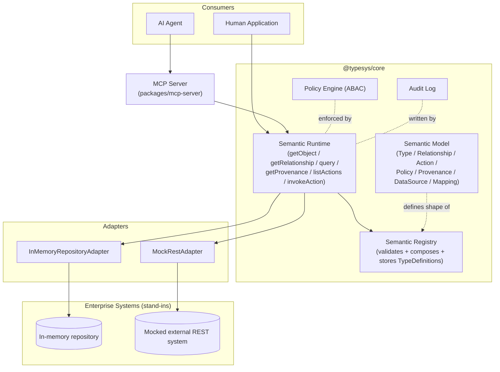
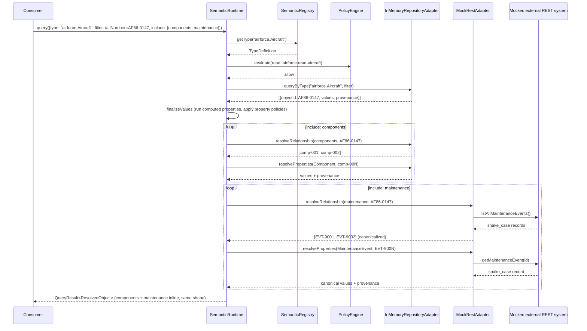
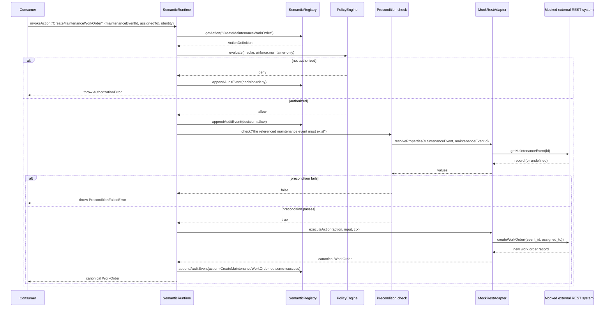

# Architecture

## The problem

Large enterprises run hundreds of disconnected systems — databases, REST APIs,
SaaS applications, legacy platforms, ERPs. Applications and AI agents that
want to reason about "an Aircraft" or "a Customer" should not need to know
that tail numbers live in IMDS, maintenance history lives in REMIS, and
supply status lives in an ERP. TypeS is a canonical semantic layer that sits
between physical enterprise systems and their consumers (human applications
and AI agents) so that a consumer can ask for an object, its relationships,
its provenance, and the actions it can perform — without ever learning which
database, API, or cloud produced the answer.

The central design principle, carried through every layer described below,
is separating three concerns that are usually tangled together:

- **what something IS** — a `Type`'s properties, relationships, and
  validation rules (the semantic model).
- **where its data comes from** — a `DataSource` and `Mapping`, executed by
  an `Adapter` (the physical binding).
- **what can be DONE to it** — an `Action`, governed by policy and audit
  (the governed capability).

## Layered architecture



Reading the diagram: a **Type** (defined in the Semantic Model) is validated
and composed by the **Semantic Registry** at registration time. The
**Semantic Runtime** is the single boundary every consumer goes through —
whether a human application calling it directly, or an AI agent calling it
indirectly through the MCP server. The Runtime resolves properties and
relationships by asking an **Adapter** (one per `DataSource`) to talk to the
real (or, in this codebase, mocked) enterprise system, and it enforces the
**Policy Engine** and writes to the **Audit Log** exactly once, at the
Runtime boundary — never re-implemented per transport.

The **Policy Engine** and **Audit Log** are drawn cutting across Query,
Action, and MCP rather than owned by any one of them, matching the
mission brief's architecture boundary:

```text
             Policy Engine
                  │
        ┌─────────┼─────────┐
        ▼         ▼         ▼
      Query     Action     MCP
```

In this codebase that boundary is realized concretely: `SemanticRuntime`
(`packages/core/src/runtime/runtime.ts`) is the only caller of
`PolicyEngine.evaluate()` and the only writer of `AuditEvent`s via
`registry.appendAuditEvent()`. The MCP server's resource and tool handlers
(`packages/mcp-server/src/resources.ts`, `src/tools.ts`) never call the
policy engine or audit log themselves — they call `runtime.getObject`,
`runtime.query`, `runtime.invokeAction`, etc., and inherit enforcement for
free.

## Registry vs. Runtime

- **`SemanticRegistry`** (`packages/core/src/registry/registry.ts`) is a
  design-time/registration-time concern. `registerType()` validates a
  `SemanticTypeSchema` against Ajv 2020-12, composes `extends` and `traits`
  into a flattened `TypeDefinition` (materializing relationships, action
  names, and computed properties once), and persists it through a
  `RegistryStore`. It also holds `DataSource`, `Mapping`, and `ActionDefinition`
  records, and the audit trail (`appendAuditEvent`/`listAuditEvents`,
  delegated to the store).
- **`SemanticRuntime`** (`packages/core/src/runtime/runtime.ts`) is the
  request-time concern. It never re-parses a schema's `x-*` vocabulary — it
  reads the already-flattened `TypeDefinition` from the registry, resolves
  the right `Adapter` via `MappingResolver`, evaluates policy, executes
  computed properties, filters denied properties, and writes audit events.

## Type composition: extends + traits, not deep inheritance

A `Type` may declare a single `extends` (one level, no chains) and zero or
more `traits`. `SemanticRegistry.registerType()` composes these into the
JSON Schema `allOf` array (`allOf: [{$ref: base}, {$ref: trait1}, ...,
ownSchema]`) and separately merges each trait's contributed
relationships/actions/computed properties into the flattened
`TypeDefinition` (own definitions win over trait definitions, which win over
the base type's). `airforce.Aircraft` is the canonical example: it
`extends: "core.Asset"` and mixes in the domain-neutral `TrackableTrait` and
`MaintainableTrait`, while declaring its own `components`/`maintenance`
relationships, `readinessStatus` computed property, and policy. See
ADR-0004 for why plain `allOf`/`$ref` was chosen over `$dynamicRef`.

## Provenance

Provenance (`ProvenanceRef`: `propertyPath`, `source.{dataSourceId, system,
recordId, field}`, `observedAt`, `retrievedAt`, `confidence`,
`classification`) is not attached to every resolved value by default. A
consumer opts in with `includeProvenance: true` on `getObject`/`query`, or
calls `runtime.getProvenance(typeName, objectId, propertyPath, identity)`
directly. For a computed property, `getProvenance` recurses into
`dependsOn` and aggregates the provenance of the underlying properties —
`Aircraft.readinessStatus` depends on `maintenanceStatus`, so its provenance
is the in-memory adapter's provenance record for `maintenanceStatus` (see
`packages/domain-airforce/test/readiness-computed-property.test.ts`).

## Resolution modes

`Mapping.resolutionMode` and `ComputedPropertyDefinition.resolutionMode` are
typed as `"live" | "materialized" | "cached"`. Only `live` and `materialized`
are actually exercised: every `Mapping` in the airforce domain
(`packages/domain-airforce/src/mappings/index.ts`) uses `"live"` — the
adapter is called at request time — and the model supports `"materialized"`
generically (a mapping could point at a pre-computed projection instead of a
live call, with zero change to the Runtime or Adapter interface). `"cached"`
is a named, documented, but unbuilt extension point (see ADR-0007) — there is
no cache layer in this codebase.

## Domain packaging

`packages/core` knows nothing about aircraft, hospitals, or any other
domain — its own manifest (`coreManifest`) registers only `Party`, `Person`,
`Organization`, `Location`, `Asset`, `Event`. A domain is an independent npm
workspace package that exports a `DomainManifest` (`domain`, `types`,
`actions?`, `dataSources?`, `mappings?`) and calls
`registerDomain(registry, manifest)`, which registers data sources, then
types (in manifest order, so `extends` targets are already registered), then
actions, then mappings. `packages/domain-airforce` is the one domain
implemented in this codebase; `docs/developer-guide/adding-a-domain.md`
walks through adding a second (Hospital) with zero changes to
`packages/core`.

## MCP mapping

`packages/mcp-server` bootstraps one `SemanticRuntime` (core + airforce
domain, both adapter styles seeded with sample data) and exposes it two ways:

- **Resources** (`src/resources.ts`) — read-only browsing: the type list,
  an individual type's flattened definition (relationships, computed
  property names, action names, schema), an object, a relationship's related
  objects, and a property's provenance. Backed by `typesys://` URIs
  (`src/resource-uri.ts`).
- **Tools** (`src/tools.ts`) — every registered `ActionDefinition` becomes an
  MCP tool 1:1 (its `inputSchema` plus an injected `authToken` field), plus
  one generic `query` tool whose input schema is the `SemanticQuery` DSL
  verbatim.

Both handlers resolve an `Identity` fresh from a bearer token on every call
(`resolveIdentity()` in `src/auth.ts`) — MCP is stateless as of the
2026-07-28 spec revision, so identity is never cached on a connection. See
ADR-0012.

## Sequence: `runtime.query()` spanning both adapter styles

The vertical slice's adapter-substitution proof
(`packages/domain-airforce/test/adapter-substitution.test.ts`) issues one
`runtime.query()` call for an Aircraft with its `components` and
`maintenance` relationships included. `components` resolves through the
in-memory repository adapter; `maintenance` resolves through the mocked
external REST adapter. The consumer-facing code path is identical either
way:



The Runtime never branches on which adapter it is talking to: both adapters
implement the same `Adapter` interface
(`packages/core/src/runtime/adapter.ts`), and the `MockRestAdapter` alone
knows how to translate `event_id`/`aircraft_tail`/`event_type` into the
canonical `id`/`aircraftId`/`eventType` shape.

## Sequence: `runtime.invokeAction("CreateMaintenanceWorkOrder", ...)`



Two audit events are written for a single successful invocation: one from
`requireAllowed`/`evaluate` (the policy decision itself, `action:
"CreateMaintenanceWorkOrder"`, `decision: "allow"`) and one from the
post-dispatch `auditRequired` check (`outcome: "success"`) — both go through
`registry.appendAuditEvent`, never through adapter or transport code.

## Non-goals carried through the implementation

Matching `docs/initial_prompt.md`'s explicit non-goals, this codebase does
not include: a real graph database (relationships are property-graph-flavored
registry records, not a graph engine), a workflow engine, a full policy-as-code
system (OPA/Cedar), or a real IdP/OIDC integration. Each of these is a
documented extension point (see the relevant ADR) rather than a speculative
implementation. Three exceptions were built once they were actually
needed, each behind the same kind of swappable interface as everything
else in this list: a production PostgreSQL-backed `RegistryStore`
(`packages/registry-store-postgres`, ADR-0015), a TTL-based cache for
`resolutionMode: "cached"` properties/relationships/computed properties
(ADR-0016), and OpenTelemetry tracing/metrics that cost nothing and do
nothing unless an application registers a real SDK (ADR-0017). The
concurrent (not sequential) fan-out for relationship/query resolution is
not a new capability but a correctness fix to existing runtime code — the
N+1 pattern a one-to-many relationship or a query's `include` previously
produced.
