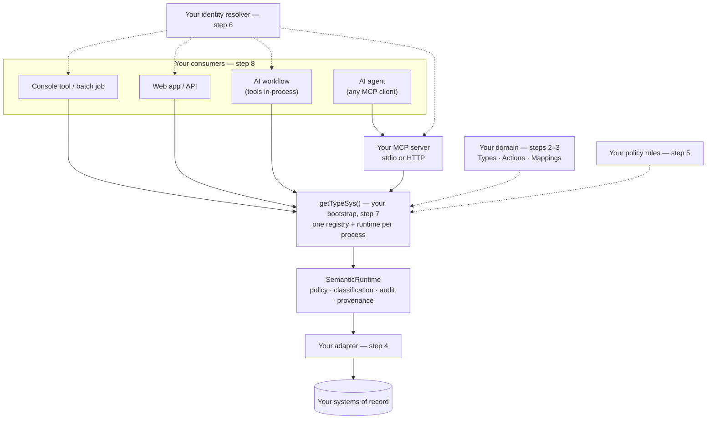

# How to start a project that uses TypeS

This guide is for building your own application on TypeS, in its own
repository: a console tool or batch job, a web app or API, an AI agent, or
an AI workflow. The [quickstart](../quickstart.md) shows the model from
inside this repo. This guide shows the project you build outside it, and
exactly where each kind of consumer plugs in.

Steps 1–7 are the same for every project. Only step 8 depends on what
you're building, so you can skip to your consumer there.

Every file below was built in a separate directory against this
repository and run, including a real MCP client against both MCP
transports, and type-checked under `strict` (2026-09-30).

## Where TypeS plugs in

Your consumers never talk to your systems of record directly, and they
never build their own runtime. Each one imports one bootstrap module,
`getTypeSys()`, which builds one registry and one `SemanticRuntime` per
process. Policy, classification, audit, and provenance all happen inside
that runtime, so a console tool, a web API, and an AI agent get identical
enforcement.



| You write | TypeS provides |
|---|---|
| Types (YAML or TypeScript) | Composition, validation, versioning (`SemanticRegistry`) |
| Mappings: which system holds which property | Multi-source reads, relationship resolution |
| An adapter per system of record, or a shipped one | In-memory, REST, and PostgreSQL adapters |
| Named policy rules | Enforcement on every read, query, and Action; the audit log |
| An identity resolver | A real OIDC/JWT verifier (`@typesys/auth-oidc`) |
| One bootstrap module | `buildRuntime`, which assembles everything |
| Your consumers | The MCP resource and tool handlers |

The running example is a small fleet domain: one Type, `fleet.Vehicle`,
and one Action, `RetireVehicle`. Replace the names with your own.

The layout you'll end up with:

```text
fleet-app/
  package.json
  tsconfig.json
  vendor/typesys/          # step 1: TypeS packages, until they're on npm
  fleet/                   # step 2: your Types, as YAML
    10-vehicle.yaml
    bindings.mjs
  src/
    domain.ts              # step 3: the manifest — Types, Actions, mappings
    adapters.ts            # step 4: the system of record
    policy.ts              # step 5: named rules
    identity.ts            # step 6: credential -> Identity
    typesys.ts             # step 7: the bootstrap every consumer imports
  apps/                    # step 8: one entry point per consumer
    console.ts
    web.ts
    mcp-stdio.ts
    mcp-http.ts
    workflow.ts
```

## Step 1. Install TypeS

`@typesys/*` isn't on the npm registry yet. The publishing infrastructure
exists, but nothing has been published
([ADR-0020](../adr/0020-publish-infrastructure.md),
[`PRODUCTION-READINESS.md`](../PRODUCTION-READINESS.md) item 14), so
`npm install @typesys/core` returns 404. Two ways work today.

**A. Vendored tarballs (for a team or CI).** Build a checkout of this repo
and pack every package into your project. Build first: the packages have
no `prepack` step, so an unbuilt checkout packs no code.

```bash
cd TypeS && npm install && npm run build
```

```bash
npm pack --workspaces --pack-destination ../fleet-app/vendor/typesys
```

Then install the ones you need from `fleet-app`:

```bash
npm install ./vendor/typesys/typesys-core-0.1.0.tgz ./vendor/typesys/typesys-cli-0.1.0.tgz ./vendor/typesys/typesys-adapter-in-memory-0.1.0.tgz
```

Commit `vendor/typesys/`. Your project then builds without a TypeS
checkout.

**B. A linked checkout (fastest while evaluating).** Point `file:`
dependencies at a built checkout. npm symlinks them, so a rebuild of the
checkout is picked up immediately:

```json
{
  "dependencies": {
    "@typesys/core": "file:../TypeS/packages/core",
    "@typesys/cli": "file:../TypeS/packages/cli",
    "@typesys/adapter-in-memory": "file:../TypeS/packages/adapter-in-memory"
  }
}
```

Once the packages are published, replace either one with
`npm install @typesys/core …`. Nothing else in this guide changes.

**Which packages you need:**

| Package | When |
|---|---|
| `@typesys/core` | Always. |
| `@typesys/cli` | You author Types in YAML (step 2), or want `typesys validate` in CI. |
| `@typesys/adapter-in-memory` | Development and tests, or as a starting point for an adapter (step 4). |
| `@typesys/mcp-server` | AI agents over MCP (step 8c). It depends on no domain. |
| `express` (or your web framework) | A web app or API (step 8b). |
| `adapter-postgres`, `registry-store-postgres`, `auth-oidc`, `policy-cedar`, `encryption`, `kms-aws`, `redis` | Production (step 9). |

The packages are ES modules. Set `"type": "module"` in `package.json`,
use `"module": "NodeNext"` in `tsconfig.json`, and add `tsx`,
`typescript`, and `@types/node` as dev dependencies to run the `.ts` files
directly.

## Step 2. Define your Types

Scaffold a directory for them:

```bash
npx typesys init ./fleet --name fleet
```

Delete the placeholder `fleet/00-example.yaml` and write your own. Files
load in alphabetical order, so number base types before the subtypes that
`extends` them:

```yaml
# fleet/10-vehicle.yaml
name: fleet.Vehicle
version: 1.0.0
title: Vehicle
description: A vehicle in the fleet.
extends: core.Asset
traits: [Trackable]

properties:
  plateNumber: { type: string }
  status: { type: string, enum: [active, retired] }
  depotId: { type: string }
required: [plateNumber, status]

actions: [RetireVehicle]

policy:
  objectPolicy: fleet.read-vehicle
```

`extends: core.Asset` gives the Type `id`, `name`, and `description`, and
the `Trackable` trait adds `trackingId` and `lastTrackedAt`. `actions:`
lists the Actions an agent browsing this Type will see; the Action itself
is defined in step 3. `objectPolicy` names the rule that decides who may
read a Vehicle; the rule itself is written in step 5.

Check it:

```bash
npx typesys validate ./fleet --bindings ./fleet/bindings.mjs
```

```
OK — 1 type(s) registered from ./fleet:
  fleet.Vehicle@1.0.0
```

Run the same command as a CI gate on any change to `fleet/`. To get
TypeScript interfaces for these Types, see
[`generate-typescript-types.md`](generate-typescript-types.md). To author
Types in TypeScript instead of YAML, as the shipped domains do, see
[`add-a-type.md`](add-a-type.md). Both produce the same registered Type.

## Step 3. Describe the domain

A `DomainManifest` is everything the registry needs to know about your
domain: its Types, its Actions, the systems that hold its data
(`dataSources`), and which system holds which property (`mappings`).

```ts
// src/domain.ts
import { readdir, readFile } from "node:fs/promises";
import { coreTraits, type ActionDefinition, type DomainManifest, type DomainTypeEntry } from "@typesys/core";
import { loadTypeYaml } from "@typesys/cli";

export const FLEET_DB = "fleet-db";

// Load every YAML Type in ../fleet, in filename order (base types first).
async function loadYamlTypes(dir: URL): Promise<DomainTypeEntry[]> {
  const files = (await readdir(dir)).filter((f) => /\.ya?ml$/.test(f)).sort();
  return Promise.all(
    files.map(async (f) => loadTypeYaml(await readFile(new URL(f, dir), "utf8"), { traitCatalog: coreTraits }))
  );
}

export const RetireVehicle: ActionDefinition = {
  id: "action-retire-vehicle",
  name: "RetireVehicle",
  description: "Takes an active vehicle out of service.",
  applicableTypes: ["fleet.Vehicle"],
  inputSchema: {
    type: "object",
    properties: { vehicleId: { type: "string" } },
    required: ["vehicleId"]
  },
  outputSchema: { type: "object" },
  authorizationPolicy: "fleet.mechanic-only",
  preconditions: [
    {
      description: "The vehicle must exist and be active",
      bindingId: "vehicleIsActive",
      check: async (ctx) => {
        const { vehicleId } = ctx.input as { vehicleId: string };
        const { values } = await ctx.getAdapter(FLEET_DB).resolveProperties("fleet.Vehicle", vehicleId, ["status"]);
        return values.status === "active";
      }
    }
  ],
  implementation: { dataSourceId: FLEET_DB, operation: "retireVehicle" },
  sideEffects: "mutates",
  idempotency: "natural",
  auditRequired: true,
  version: "1.0.0"
};

export async function loadFleetManifest(): Promise<DomainManifest> {
  return {
    domain: "fleet",
    types: await loadYamlTypes(new URL("../fleet/", import.meta.url)),
    actions: [RetireVehicle],
    dataSources: [{ id: FLEET_DB, name: "Fleet database", kind: "in-memory" }],
    mappings: [
      {
        id: "map-vehicle",
        typeName: "fleet.Vehicle",
        target: "property",
        targetName: "*",
        dataSourceId: FLEET_DB,
        operation: "get",
        resolutionMode: "live"
      }
    ]
  };
}
```

- **The mapping** with `targetName: "*"` says every property of a Vehicle
  comes from `fleet-db`. Add per-property mappings to pull some properties
  from a different system: see
  [`combine-multiple-sources.md`](combine-multiple-sources.md).
- **The Action** is the only way a consumer changes anything. Before the
  side effect runs, the runtime checks `authorizationPolicy`, validates
  the input against `inputSchema`, and runs every precondition. Then it
  calls the adapter that `implementation.dataSourceId` names
  ([ADR-0005](../adr/0005-actions-as-first-class-governed-capabilities.md)).
  Relationships between Types are covered in
  [`add-a-relationship-and-action.md`](add-a-relationship-and-action.md).
- **Actions are optional.** A read-only project leaves out `actions` and
  the Type's `actions:` line.

## Step 4. Connect your system of record

An adapter reads your system on the runtime's behalf and runs the side
effects of your Actions. Start with the in-memory adapter so everything
runs before you've touched a real backend. It has no Action
implementations of its own, so extend it with yours:

```ts
// src/adapters.ts
import type { ActionContext, ActionDefinition } from "@typesys/core";
import { InMemoryRepositoryAdapter } from "@typesys/adapter-in-memory";
import { FLEET_DB } from "./domain.js";

// A stand-in for your real system of record. Reads come from the in-memory
// store; the one Action this domain declares is implemented here, because an
// Action's side effect always runs in the adapter its `implementation` names.
export class FleetAdapter extends InMemoryRepositoryAdapter {
  constructor() {
    super(FLEET_DB, "fleet-db (in-memory)");
  }

  override async executeAction(action: ActionDefinition, input: unknown, ctx: ActionContext): Promise<unknown> {
    if (action.implementation.operation === "retireVehicle") {
      const { vehicleId } = input as { vehicleId: string };
      const { values } = await this.resolveProperties("fleet.Vehicle", vehicleId, []);
      const updated = { ...values, status: "retired" };
      this.seed("fleet.Vehicle", [{ objectId: vehicleId, values: updated }]);
      return updated;
    }
    return super.executeAction(action, input, ctx);
  }
}

export const sampleVehicles = [
  { objectId: "veh-1", values: { id: "veh-1", name: "Van 1", plateNumber: "FLT-001", status: "active", depotId: "north" } },
  { objectId: "veh-2", values: { id: "veh-2", name: "Van 2", plateNumber: "FLT-002", status: "active", depotId: "south" } },
  { objectId: "veh-3", values: { id: "veh-3", name: "Truck 1", plateNumber: "FLT-003", status: "retired", depotId: "north" } }
];
```

In step 9 you replace this with an adapter for your real system: the
shipped PostgreSQL adapter, or your own. An adapter is one small
interface; see [`write-an-adapter.md`](write-an-adapter.md). Nothing else
in the project changes when you swap it.

## Step 5. Write your policy rules

Every policy name your Types and Actions reference needs a rule. A name
with no rule is denied, so a missing rule fails closed.

```ts
// src/policy.ts
import { requireRole, type PolicyRule } from "@typesys/core";

// Every policy name your Types and Actions reference must have a rule here.
// A name with no rule is denied.
export const fleetPolicyRules: Record<string, PolicyRule> = {
  "fleet.read-vehicle": requireRole("dispatcher", "mechanic"),
  "fleet.mechanic-only": requireRole("mechanic")
};
```

`requireRole` decides on who is asking. To decide on the record too, for
example "a driver reads only their own vehicle", use
`requireAttributeMatch`, and combine rules with `anyOf` and `allOf`. See
[`add-a-policy-rule.md`](add-a-policy-rule.md). For Cedar instead of
these functions, see
[`policy-cedar`](../../packages/policy-cedar/README.md).

## Step 6. Resolve identity

Every runtime call takes an `Identity`: who is asking, their roles, and
any attributes your rules use. Each consumer has a different credential
(an environment variable, a request header, an MCP token), so write one
function that turns any of them into an `Identity`:

```ts
// src/identity.ts
import type { Identity } from "@typesys/core";

// Turns whatever credential your consumer has into an Identity. This version
// is a static token map for development; swap in a real verifier (step 9)
// without changing any caller.
export type ResolveIdentity = (token: string | undefined | null) => Promise<Identity>;

const ANONYMOUS: Identity = { subjectId: "anonymous", roles: [], attributes: {} };

const DEV_TOKENS: Record<string, Identity> = {
  "dev-dispatcher": { subjectId: "dana", roles: ["dispatcher"], attributes: {} },
  "dev-mechanic": { subjectId: "max", roles: ["mechanic"], attributes: {} }
};

export const resolveIdentity: ResolveIdentity = async (token) => (token && DEV_TOKENS[token]) || ANONYMOUS;
```

This signature is the same as `@typesys/mcp-server`'s `IdentityResolver`
and `@typesys/auth-oidc`'s resolver, so the MCP server takes this function
directly, and the production swap in step 9 is one line.

## Step 7. Assemble the runtime

This module is where TypeS plugs into your project. `buildRuntime`
registers the manifests in order, builds the policy engine from your
rules, and constructs the runtime over your adapters:

```ts
// src/typesys.ts
import { buildRuntime, coreManifest, type SemanticRegistry, type SemanticRuntime } from "@typesys/core";
import { loadFleetManifest } from "./domain.js";
import { FleetAdapter, sampleVehicles } from "./adapters.js";
import { fleetPolicyRules } from "./policy.js";

export interface TypeSys {
  registry: SemanticRegistry;
  runtime: SemanticRuntime;
}

async function start(): Promise<TypeSys> {
  const fleetDb = new FleetAdapter();
  fleetDb.seed("fleet.Vehicle", sampleVehicles);

  const { registry, runtime } = await buildRuntime({
    manifests: [coreManifest, await loadFleetManifest()],
    adapters: [fleetDb],
    policyRules: fleetPolicyRules
  });
  return { registry, runtime };
}

let started: Promise<TypeSys> | undefined;

// One runtime per process, shared by every caller. Building one per request
// would throw away the cache, the rate limiter's state, and the in-memory audit log.
export function getTypeSys(): Promise<TypeSys> {
  started ??= start();
  return started;
}
```

`coreManifest` comes first because `fleet.Vehicle` extends `core.Asset`.
Every production change in step 9 (a durable registry, caching, rate
limits, classification, a security profile) lands in this module or in a
file it imports. Your consumers never change.

## Step 8. Plug in your consumer

Each consumer is a thin entry point: get the runtime, resolve the
caller's identity, call the runtime. Pick the ones you're building.

| Consumer | Calls | Identity comes from |
|---|---|---|
| [Console tool or batch job](#8a-console-tool-or-batch-job) | the runtime directly | an environment variable or service account |
| [Web app or API](#8b-web-app-or-api) | the runtime, from your route handlers | each request's `Authorization` header |
| [AI agent](#8c-ai-agent-over-mcp) | your MCP server | the MCP call's token, or the header over HTTP |
| [AI workflow](#8d-ai-workflow-in-process) | the runtime, through tools generated from the registry | the workflow run, never the model |

What every consumer gets back:

- **`query` drops rows the caller may not read.** A caller whose rows are
  merely hidden gets an empty page: an error there would reveal that
  hidden rows exist ([ADR-0030](../adr/0030-row-level-authorization.md)).
  A caller who can read none of the Type, whatever the store holds, is
  refused with `AuthorizationError` instead: their role doesn't qualify,
  or the Type is classified above their clearance
  ([ADR-0049](../adr/0049-a-query-the-caller-can-read-none-of-is-refused.md)).
- **`getObject` throws `AuthorizationError`** when the caller may not read
  the object, and `ObjectNotFoundError` (a `NotFoundError`) for an id the
  store doesn't hold, but only to a caller the policy allows: a denied
  caller gets the same `AuthorizationError` either way
  ([ADR-0048](../adr/0048-a-missing-object-is-not-found.md)). A reference
  to an object the store no longer holds is left out of a relationship.
  `NotFoundError` also means an unknown Type, relationship, or Action.
- **`invokeAction` throws** `AuthorizationError` (policy),
  `InvalidInputError` (input schema), or `PreconditionFailedError` before
  any side effect runs.
- **`RateLimitExceededError`** if you turn on rate limiting.

### 8a. Console tool or batch job

```ts
// apps/console.ts
import { getTypeSys } from "../src/typesys.js";
import { resolveIdentity } from "../src/identity.js";

const { runtime } = await getTypeSys();
const identity = await resolveIdentity(process.env.FLEET_TOKEN);

const { items } = await runtime.query(
  {
    type: "fleet.Vehicle",
    filter: { property: "status", operator: "eq", value: "active" },
    sort: [{ property: "plateNumber" }]
  },
  identity
);

console.log(`${items.length} active vehicle(s) visible to ${identity.subjectId}:`);
for (const v of items) console.log(`  ${v.objectId}  ${String(v.values.plateNumber)}  depot=${String(v.values.depotId)}`);
```

```bash
FLEET_TOKEN=dev-dispatcher npx tsx apps/console.ts
```

```
2 active vehicle(s) visible to dana:
  veh-1  FLT-001  depot=north
  veh-2  FLT-002  depot=south
```

Without `FLEET_TOKEN` the anonymous identity can read no Vehicle, so the
query throws `Not authorized: read fleet.Vehicle`; catch `AuthorizationError`
if your tool should say so nicely. The query language (filters, `sort`, `select`,
`include`, `search`, `aggregate`) is in
[ADR-0011](../adr/0011-query-dsl-not-graphql.md) and
[ADR-0027](../adr/0027-query-dsl-extensions.md).

### 8b. Web app or API

Your server imports the runtime; the browser never does. A browser front
end calls your API, and your API calls the runtime with the identity from
that request. The same pattern works in any Node framework. This example
uses Express:

```ts
// apps/web.ts
import express, { type NextFunction, type Request, type Response } from "express";
import {
  AuthorizationError,
  InvalidInputError,
  NotFoundError,
  PreconditionFailedError,
  RateLimitExceededError
} from "@typesys/core";
import { getTypeSys } from "../src/typesys.js";
import { resolveIdentity } from "../src/identity.js";

const { runtime } = await getTypeSys();
const app = express();
app.use(express.json());

// Identity is resolved on every request, from that request's own credential.
const identityOf = (req: Request) => resolveIdentity(req.header("authorization")?.replace(/^Bearer /i, ""));

app.get("/vehicles", async (req, res) => {
  const status = typeof req.query.status === "string" ? req.query.status : undefined;
  const result = await runtime.query(
    { type: "fleet.Vehicle", ...(status ? { filter: { property: "status", operator: "eq", value: status } } : {}) },
    await identityOf(req)
  );
  res.json(result);
});

app.get("/vehicles/:id", async (req, res) => {
  // An id the store doesn't hold throws ObjectNotFoundError, a NotFoundError: the handler below makes it a 404.
  res.json(await runtime.getObject("fleet.Vehicle", req.params.id, await identityOf(req)));
});

app.post("/vehicles/:id/retire", async (req, res) => {
  res.json(await runtime.invokeAction("RetireVehicle", { vehicleId: req.params.id }, await identityOf(req)));
});

// The runtime's errors map one-to-one onto HTTP statuses.
app.use((err: unknown, _req: Request, res: Response, _next: NextFunction) => {
  const status =
    err instanceof NotFoundError ? 404
    : err instanceof AuthorizationError ? 403
    : err instanceof InvalidInputError ? 400
    : err instanceof PreconditionFailedError ? 409
    : err instanceof RateLimitExceededError ? 429
    : 500;
  res.status(status).json({ error: status === 500 ? "Internal error" : (err as Error).message });
});

const port = Number(process.env.PORT ?? 3000);
app.listen(port, () => console.log(`fleet API on http://localhost:${port}`));
```

```bash
npx tsx apps/web.ts
```

```bash
curl -X POST -H "Authorization: Bearer dev-mechanic" localhost:3000/vehicles/veh-2/retire
```

| Request | Response |
|---|---|
| `GET /vehicles` as `dev-dispatcher` | 200, the vehicles |
| `GET /vehicles` with no token | 403 `Not authorized: read fleet.Vehicle` |
| `GET /vehicles/veh-2` as `dev-dispatcher` | 200, the vehicle |
| `GET /vehicles/veh-2` with no token | 403 `Not authorized: read fleet.Vehicle/veh-2` |
| `GET /vehicles/nope` as `dev-dispatcher` | 404 `Not found: fleet.Vehicle/nope` |
| `GET /vehicles/nope` with no token | 403 `Not authorized: read fleet.Vehicle/nope`, the same as for `veh-2` |
| `POST /vehicles/veh-2/retire` as `dev-dispatcher` | 403 `Not authorized: invoke fleet.Vehicle/RetireVehicle` |
| `POST /vehicles/veh-2/retire` as `dev-mechanic` | 200, the retired vehicle |
| the same again | 409 `Precondition failed … must exist and be active` |

### 8c. AI agent over MCP

An MCP server makes your domain available to any MCP client: a desktop
or IDE assistant, or a hosted agent. Every registered Type becomes a
resource and every Action a tool, plus generic `query` and `aggregate`
tools. `@typesys/mcp-server` serves any registry and runtime, and
assumes nothing else: you pass your bootstrap's result and your identity
resolver, and it has no built-in identities
([ADR-0050](../adr/0050-the-mcp-server-serves-any-registry.md)).

**Local agents (stdio).** The client launches your server as a subprocess
running as the local user. Over stdio a token travels in-band (`?token=`
on a resource URI, `authToken` in a tool call's arguments), so fall back
to the operator's own token when a call carries none:

```ts
// apps/mcp-stdio.ts
import { StdioServerTransport } from "@modelcontextprotocol/sdk/server/stdio.js";
import { createServer } from "@typesys/mcp-server";
import { getTypeSys } from "../src/typesys.js";
import { resolveIdentity } from "../src/identity.js";

// A local agent (a desktop or IDE assistant) launches this as a subprocess.
// It runs as the local operator, so a call that carries no token falls back
// to the operator's own token from the environment.
const { server } = createServer(await getTypeSys(), (token) => resolveIdentity(token ?? process.env.FLEET_TOKEN), {
  name: "fleet",
  version: "0.1.0"
});
await server.connect(new StdioServerTransport());
```

Register it with your client. Most MCP clients take a command, its
arguments, and its environment, in a shape like this `.mcp.json`:

```json
{
  "mcpServers": {
    "fleet": {
      "command": "npx",
      "args": ["tsx", "apps/mcp-stdio.ts"],
      "env": { "FLEET_TOKEN": "dev-dispatcher" }
    }
  }
}
```

**Remote agents (HTTP).** A hosted agent sends
`Authorization: Bearer <token>` on every request. `createHttpApp` is the
server: stateless, a fresh MCP server and transport for each request over
the one backend you built, with the header winning over any token sent
in-band, and `/healthz` and `/readyz` included
([ADR-0021](../adr/0021-http-transport.md)):

```ts
// apps/mcp-http.ts
import { createHttpApp } from "@typesys/mcp-server";
import { getTypeSys } from "../src/typesys.js";
import { resolveIdentity } from "../src/identity.js";

const app = createHttpApp({
  backend: await getTypeSys(),
  identityResolver: resolveIdentity,
  serverInfo: { name: "fleet", version: "0.1.0" }
});

const port = Number(process.env.PORT ?? 3939);
app.listen(port, () => console.log(`fleet MCP on http://localhost:${port}/mcp`));
```

Either way, `tools/list` returns `RetireVehicle`, `query`, and
`aggregate`. A `RetireVehicle` call as a dispatcher comes back as a tool
error, `Not authorized: invoke fleet.Vehicle/RetireVehicle`; as a
mechanic, it retires the vehicle. A `query` with no token comes back as
a tool error too, `Not authorized: read fleet.Vehicle`, rather than an
empty result that would read as "there are no vehicles". `resources/list`
lists your Types; an agent finds an object with `query` and reads it by
URI. The exact resource URIs and tool shapes an agent uses are in
[`for-agents.md`](../for-agents.md). TLS, CORS, and an OAuth
authorization server belong in a gateway in front of the HTTP server; see
[`run-mcp-over-http.md`](run-mcp-over-http.md).

### 8d. AI workflow in-process

Use this when your own code runs the model loop: an agent framework, a
tool-use loop against a model API, or a pipeline step. There are two
ways to give the model access:

- **The framework speaks MCP.** Connect it to your MCP server from 8c.
  Nothing more to build.
- **The framework takes plain tool functions.** Generate them from the
  registry, as below. The workflow binds the identity; the model never
  supplies it.

```ts
// apps/workflow.ts
import { getTypeSys } from "../src/typesys.js";
import { resolveIdentity } from "../src/identity.js";

// An AI workflow that runs its own model loop in this process. It hands the
// model tools generated from the registry, with identity bound by the
// workflow, never taken from the model's arguments.
const { runtime } = await getTypeSys();
const identity = await resolveIdentity(process.env.FLEET_TOKEN);

const available = await runtime.listActions("fleet.Vehicle", identity);
const tools = [
  {
    name: "find_vehicles",
    description: "Query fleet.Vehicle objects with the TypeS query DSL (filter, sort, limit).",
    inputSchema: { type: "object", properties: { filter: { type: "object" }, limit: { type: "number" } } },
    run: (input: Record<string, unknown>) => runtime.query({ ...input, type: "fleet.Vehicle" }, identity)
  },
  ...available
    .filter((a) => a.authorized)
    .map(({ action }) => ({
      name: action.name,
      description: action.description,
      inputSchema: action.inputSchema,
      run: (input: Record<string, unknown>) => runtime.invokeAction(action.name, input, identity)
    }))
];

console.log(`Tools for ${identity.subjectId}: ${tools.map((t) => t.name).join(", ")}`);

// Hand `tools` to your model SDK's tool-use loop. Simulated here: two calls a model might make.
const found = await tools[0]!.run({ filter: { property: "depotId", operator: "eq", value: "north" } });
console.log("find_vehicles ->", JSON.stringify(found));
const retire = tools.find((t) => t.name === "RetireVehicle");
if (retire) console.log("RetireVehicle ->", JSON.stringify(await retire.run({ vehicleId: "veh-1" })));
```

```bash
FLEET_TOKEN=dev-mechanic npx tsx apps/workflow.ts
```

```
Tools for max: find_vehicles, RetireVehicle
find_vehicles -> {"items":[{"typeName":"fleet.Vehicle","objectId":"veh-1",…},{"typeName":"fleet.Vehicle","objectId":"veh-3",…}]}
RetireVehicle -> {"id":"veh-1","name":"Van 1","plateNumber":"FLT-001","status":"retired","depotId":"north"}
```

As `dev-dispatcher`, the tool list is only `find_vehicles`:
`listActions` reports which Actions the identity may invoke, so the model
never sees a tool it would be denied. The runtime still checks policy on
every call, so a filtered list is a convenience, not the control.

A workflow with no model, such as a scheduled job, is a console consumer
(8a) with a service identity.

## Step 9. Take it to production

Every row below changes files from steps 2–7. No consumer in step 8
changes.

| Replace | With | Guide |
|---|---|---|
| The in-memory adapter | The PostgreSQL adapter, or your own | [`use-postgres.md`](use-postgres.md), [`write-an-adapter.md`](write-an-adapter.md) |
| The in-memory registry | `PostgresRegistryStore`, passed as `buildRuntime({ store })` | [`use-postgres.md`](use-postgres.md) |
| The dev token map | `@typesys/auth-oidc` (below) | [`auth-oidc`](../../packages/auth-oidc/README.md), [ADR-0018](../adr/0018-oidc-identity-resolution.md) |
| Role-only rules | Row-level rules, or Cedar | [`add-a-policy-rule.md`](add-a-policy-rule.md) |
| Unmarked data | Classification markings and a scheme | [`classify-data.md`](classify-data.md) |
| Plaintext sensitive fields | `EncryptingAdapter` around your adapter | [`encrypt-fields.md`](encrypt-fields.md) |
| Every read hitting the backend | Caching | [`enable-caching.md`](enable-caching.md) |
| Unbounded callers | Rate limits and concurrency bounds | [`enable-rate-limiting-and-concurrency-bounds.md`](enable-rate-limiting-and-concurrency-bounds.md) |
| No visibility | OpenTelemetry traces and metrics | [`enable-observability.md`](enable-observability.md) |
| Default settings | The `HIGH_ASSURANCE_V1` profile | [`run-high-assurance.md`](run-high-assurance.md) |
| `npx tsx` | A compiled build in a container | [`deploy-with-containers.md`](deploy-with-containers.md) |
| One process | Several replicas sharing Redis | [`run-multiple-instances.md`](run-multiple-instances.md) |

The identity swap is one file, because the OIDC resolver has the same
signature as the dev one:

```ts
// src/identity.ts, production
import type { Identity } from "@typesys/core";
import { createOidcIdentityResolver } from "@typesys/auth-oidc";

export type ResolveIdentity = (token: string | undefined | null) => Promise<Identity>;

const issuer = process.env.OIDC_ISSUER;
if (!issuer) throw new Error("OIDC_ISSUER is not set");

export const resolveIdentity: ResolveIdentity = createOidcIdentityResolver({ issuer, audience: "fleet" });
```

By default an invalid or expired token resolves to the anonymous
identity, which your policy rules then deny. Pass
`failOpenToAnonymous: false` to throw instead, for example to return 401
from your web API.

The repo's `Dockerfile` builds this repository's demo MCP server, not
your project. Use it as a pattern (multi-stage, non-root, a `/healthz`
check) and point its `CMD` at your own compiled entry point.

Before production traffic, read
[`PRODUCTION-READINESS.md`](../PRODUCTION-READINESS.md). It ranks what
still stands between this reference implementation and real production
use.
